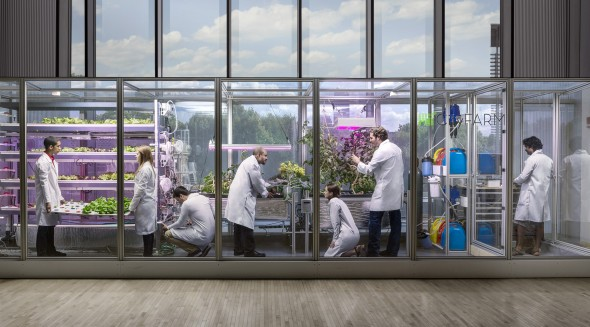
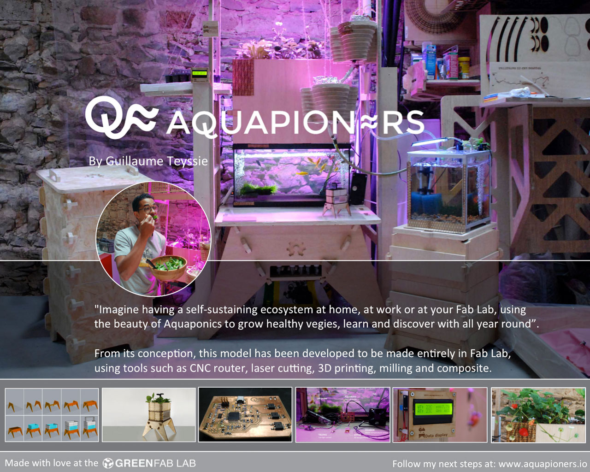

# Food - Agriculture

---

- [2015](http://www.wired.co.uk/magazine/archive/2014/10/features/server-farm)
- [2016](http://openag.media.mit.edu/)
- [2017 - 2021](http://aquapioneers.io)
- [2022 – 2025](https://fabacademy.org/2021/labs/agrilab/recitation/agriculture/#fabacademy-projects-around-agriculture)

---

///caption  
Food, 2015–2016  
///

///caption  
Food, 2017–2025  
///
