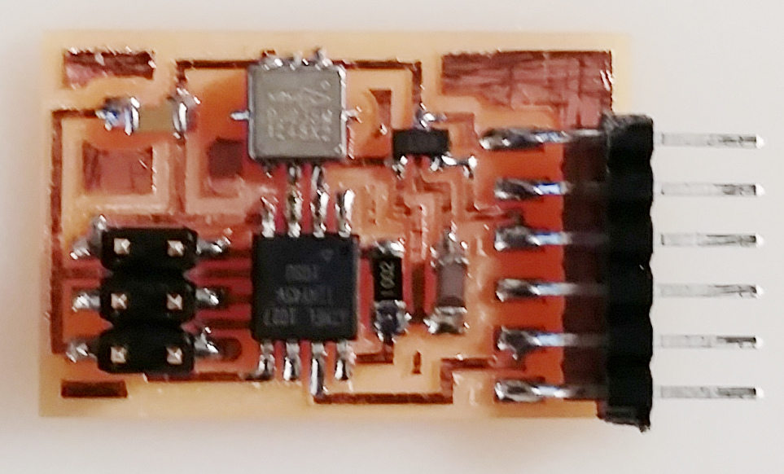
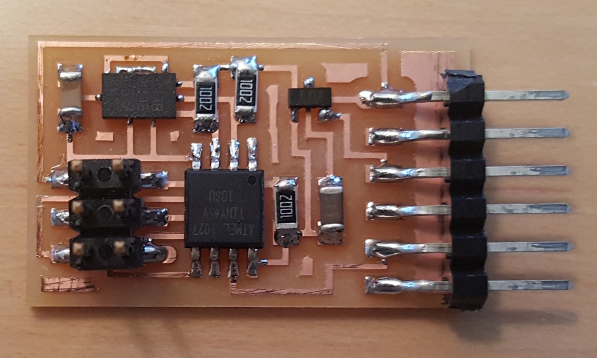
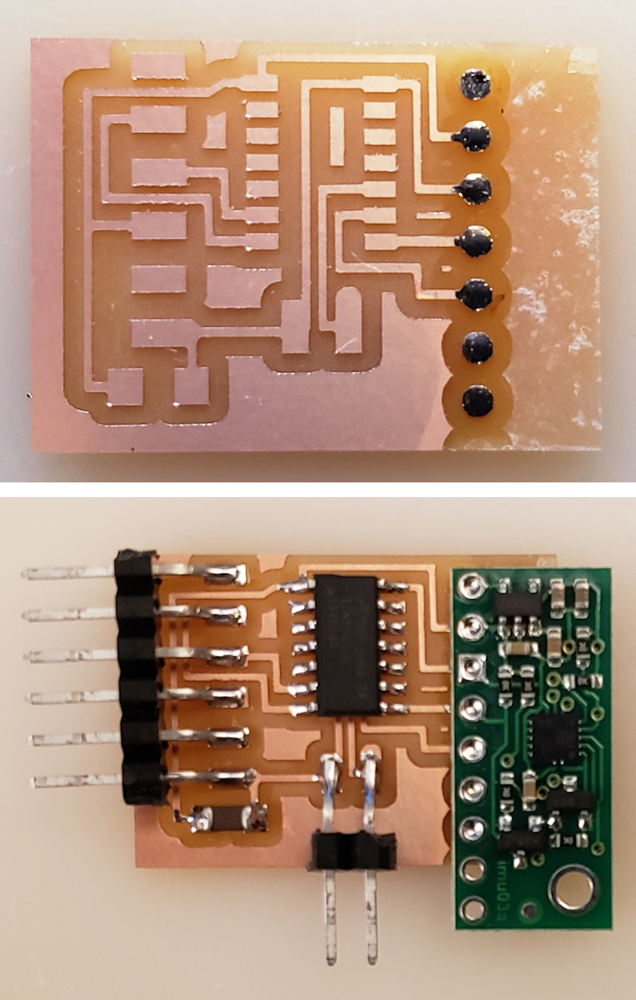
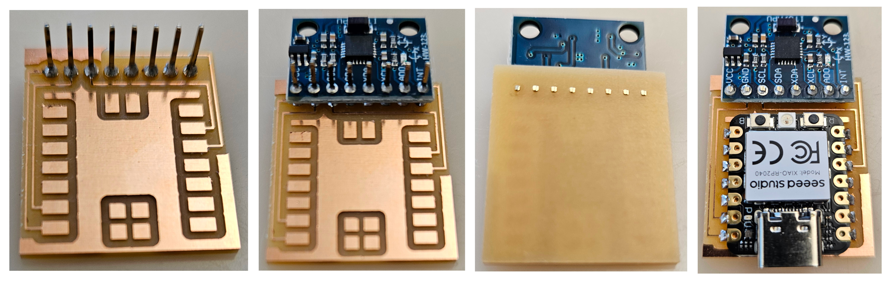
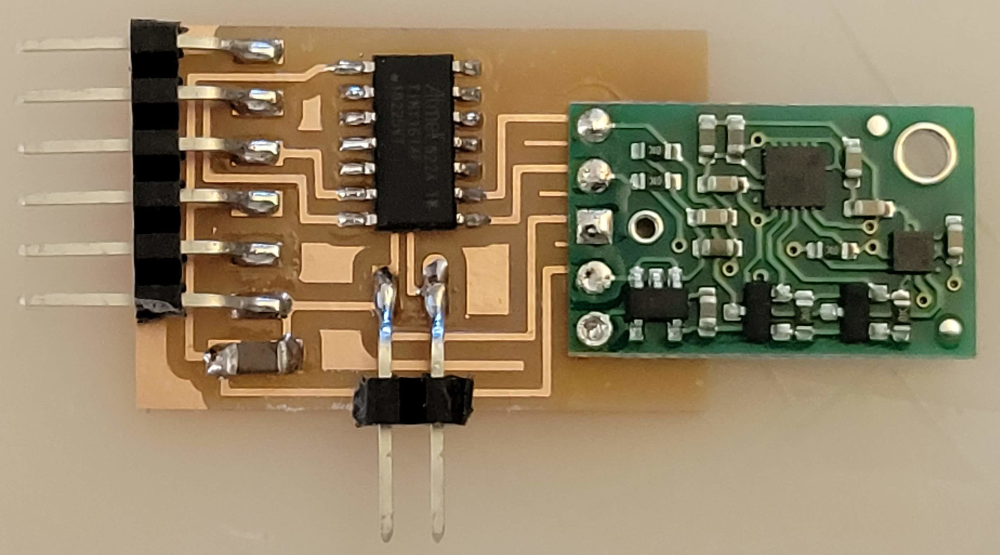
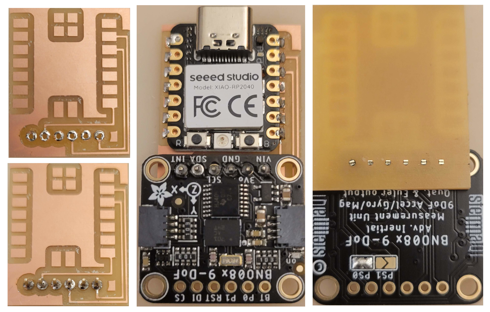

# Acceleration, orientation, rotation

---

## 2D accelerometer

### Hello accel 45 (2014)

[MXD6235MP](http://www.digikey.com/product-detail/en/MXD6235MP/1267-1012-1-ND)

  
///caption  
Components  
///

[hello.accel.45.cad](accel/hello.accel.45.cad)  
[board](accel/hello.accel.45.png) [traces](accel/hello.accel.45.traces.png) [interior](accel/hello.accel.45.interior.png)  
[hello.accel.45.c](accel/hello.accel.45.c) [makefile](accel/hello.accel.45.make)  
[hello.accel.45.py](accel/hello.accel.45.py) [video](accel/hello.MXD6235MP.mp4)

---

### Hello MXD6235MP (2015)

[MXD6235MP](http://www.digikey.com/product-detail/en/MXD6235MP/1267-1012-1-ND)

  
///caption  
Components  
///

[hello.MXD6235MP.cad](accel/hello.MXD6235MP.cad)  
[board](accel/hello.MXD6235MP.png) [traces](accel/hello.MXD6235MP.traces.png) [interior](accel/hello.MXD6235MP.interior.png)  
[hello.MXD6235MP.c](accel/hello.MXD6235MP.c) [makefile](accel/hello.MXD6235MP.make)  
[hello.MXD6235MP.py](accel/hello.MXD6235MP.py) [video](accel/hello.MXD6235MP.mp4)

---

## 3D accelerometer

### Hello ADXL343 (2015)

[ADXL343BCCZ](http://www.digikey.com/product-detail/en/ADXL343BCCZ/ADXL343BCCZ-ND)

  
///caption  
Components  
///

[hello.ADXL343.cad](accel/hello.ADXL343.cad)  
[board](accel/hello.ADXL343.png) [traces](accel/hello.ADXL343.traces.png) [interior](accel/hello.ADXL343.interior.png) [reflow](accel/hello.ADXL343.reflow.jpg)  
[hello.ADXL343.c](accel/hello.ADXL343.c) [makefile](accel/hello.ADXL343.make) [calibration](http://www.analog.com/media/en/technical-documentation/data-sheets/ADXL343.pdf)  
[hello.ADXL343.py](accel/hello.ADXL343.py) [video](accel/hello.ADXL343.mp4)

---

## 6 axis accelerometer + gyroscope

### Hello LSM6DS33 (ATtiny1614) (2020)

[LSM6DS33TR](http://www.digikey.com/product-detail/en/LSM6DS33TR/497-15996-1-ND)  
[Pololu breakout board](https://www.digikey.com/en/products/detail/pololu-corporation/2736/10451119)  
[Arduino library](https://github.com/pololu/lsm6-arduino)

  
///caption  
Components  
///

[hello.LSM6DS33.t1614](accelgyro/hello.LSM6DS33.t1614)  
[board](accelgyro/hello.LSM6DS33.t1614.png) [traces](accelgyro/hello.LSM6DS33.t1614.traces.png) [interior](accelgyro/hello.LSM6DS33.t1614.interior.png)  
[hello.LSM6DS33.ino](accelgyro/hello.LSM6DS33.ino) [hello.LSM6DS33.py](accelgyro/hello.LSM6DS33.py) [video](accelgyro/hello.LSM6DS33.mp4)

---

### Hello MPU-6050 (RP2040)

[MPU-6050](https://invensense.tdk.com/products/motion-tracking/6-axis/mpu-6050)  
[module](https://www.amazon.com/HiLetgo-MPU-6050-Accelerometer-Gyroscope-Converter/dp/B00LP25V1A)  
Also see: [ICM-20609](https://invensense.tdk.com/products/motion-tracking/6-axis/icm-20609)

  
///caption  
Components  
///

[hello.MPU-6050.RP2040](imu/6050/hello.MPU-6050.RP2040)  
[board](imu/6050/hello.MPU-6050.RP2040.png) [top](imu/6050/hello.MPU-6050.RP2040.top.png) [holes](imu/6050/hello.MPU-6050.RP2040.holes.png) [interior](imu/6050/hello.MPU-6050.RP2040.interior.png)  
[hello.MPU-6050.ino](imu/6050/hello.MPU-6050.ino) [hello.MPU-6050.py](imu/6050/hello.MPU-6050.py) [video](imu/6050/hello.MPU-6050.RP2040.mp4)

---

## 9 axis accelerometer + gyroscope + magnetometer

### Hello MinIMU-9 v5 (ATtiny1614)

[MinIMU-9 v5](https://www.digikey.com/en/products/detail/pololu-corporation/2738/10451104)  
[Pololu module](https://www.pololu.com/product/2738)  
[Arduino library](https://github.com/pololu/minimu-9-ahrs-arduino)

  
///caption  
Components  
///

[hello.MinIMU9v5.t1614](accelgyromag/hello.MinIMU9v5.t1614)  
[board](accelgyromag/hello.MinIMU9v5.t1614.png) [traces](accelgyromag/hello.MinIMU9v5.t1614.traces.png) [interior](accelgyromag/hello.MinIMU9v5.t1614.interior.png)  
[hello.MinIMU9v5.ino](accelgyromag/hello.MinIMU9v5.ino) [hello.MinIMU9v5.py](accelgyromag/hello.MinIMU9v5.py) [video](accelgyromag/hello.MinIMU9v5.mp4)

---

### Hello BNO085 / BNO086 (RP2040)

[BNO085](https://www.digikey.com/en/products/detail/ceva-technologies-inc/BNO085/9445940)  
[BNO086](https://www.digikey.com/en/products/detail/ceva-technologies-inc/BNO086/14114190)  
[Adafruit module](https://www.adafruit.com/product/4754)  
[RVC Serial Docs](https://learn.adafruit.com/adafruit-9-dof-orientation-imu-fusion-breakout-bno085?view=all)

  
///caption  
Components  
///

[hello.4754.RP2040](imu/hello.4754.RP2040)  
[board](imu/hello.4754.RP2040.png) [traces](imu/hello.4754.RP2040.top.png) [holes](imu/hello.4754.RP2040.holes.png) [interior](imu/hello.4754.RP2040.interior.png)  
[hello.4754.RP2040.py](imu/hello.4754.RP2040.py) [hello.4754.RP2040.html](imu/hello.4754.RP2040.html) [video](imu/hello.4754.RP2040.mp4)

[SH-2 Reference Manual](https://www.ceva-ip.com/wp-content/uploads/2019/10/SH-2-Reference-Manual.pdf)  
[SH2 library](https://github.com/ceva-dsp/sh2)  
[I²C library](https://github.com/sparkfun/SparkFun_BNO08x_Arduino_Library)  
coming

---

