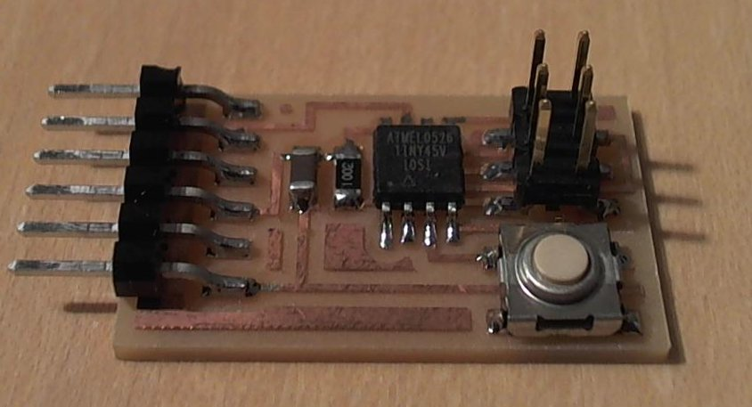
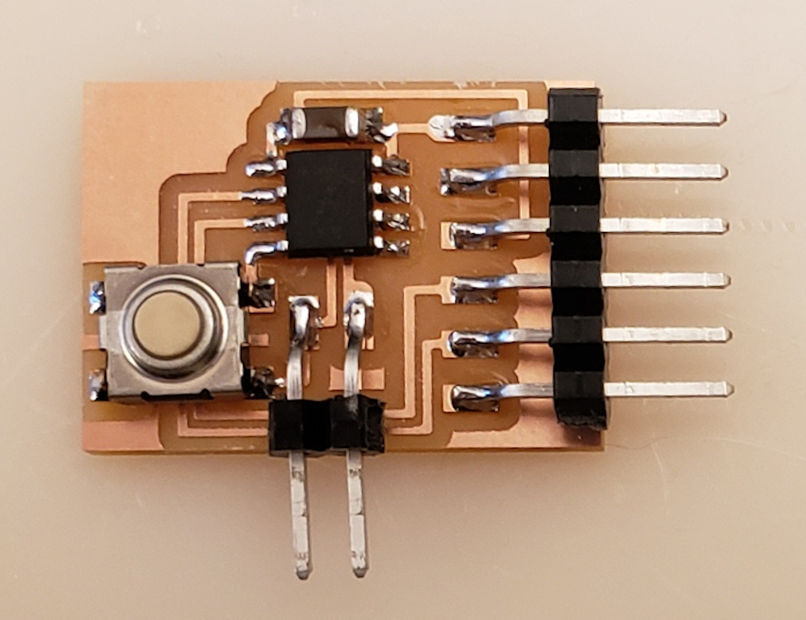
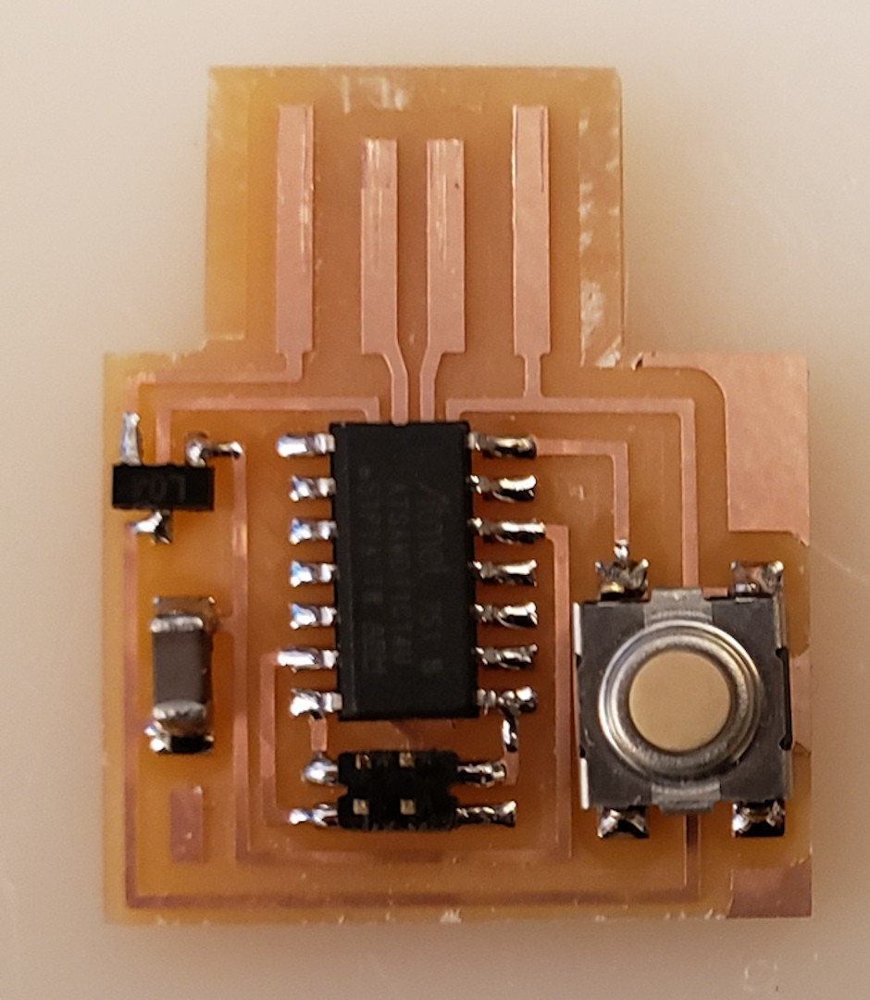

# Switch/button

[button](http://search.digikey.com/scripts/DkSearch/dksus.dll?Detail&name=SW262CT-ND)  
[slide](http://search.digikey.com/scripts/DkSearch/dksus.dll?Detail&name=401-2012-1-ND)

## Hello button 45 (2012)

///caption  
Components  
///

[hello.button.45.cad](button/hello.button.45.cad) [board](button/hello.button.45.png) [traces](button/hello.button.45.traces.png) [interior](button/hello.button.45.interior.png)  
[hello.button.45.c](button/hello.button.45.c) [makefile](button/hello.button.45.make)  
[pySerial](http://pyserial.sourceforge.net/) [rx.py](python/rx.py) [term.py](python/term.py) [video](button/hello.button.45.mp4)

## Hello button t412 (2020)

///caption  
Components  
///

[hello.button.t412](button/hello.button.t412) [board](button/hello.button.t412.png) [traces](button/hello.button.t412.traces.png) [interior](button/hello.button.t412.interior.png)  
[hello.button.serial.ino](button/hello.button.serial.ino) [hello.button.t412.ino](button/hello.button.t412.ino)

## Hello button D11C (2020)

///caption  
Components  
///

[hello.button.D11C](button/hello.button.D11C) [board](button/hello.button.D11C.png) [traces](button/hello.button.D11C.traces.png) [interior](button/hello.button.D11C.interior.png)  
[hello.button.USB.ino](button/hello.button.USB.ino) [hello.button.D11C.ino](button/hello.button.D11C.ino)

## Hello button-blink C3 (2023)

///caption  
Components  
///

[hello.button-blink.C3](../../classes/embedded_programming/ESP32-C3/hello.button-blink.C3) 
[board](../../classes/embedded_programming/ESP32-C3/hello.button-blink.C3.png) 
[traces](../../classes/embedded_programming/ESP32-C3/hello.button-blink.C3.top.png) 
[interior](../../classes/embedded_programming/ESP32-C3/hello.button-blink.C3.interior.png)  

[hello.button-blink.C3.ino](../../classes/embedded_programming/ESP32-C3/hello.button-blink.C3.ino) 
[hello.button-blink.C3.py](../../classes/embedded_programming/ESP32-C3/hello.button-blink.C3.py) 

[video](../../classes/embedded_programming/ESP32-C3/hello.button-blink.C3.mp4)

