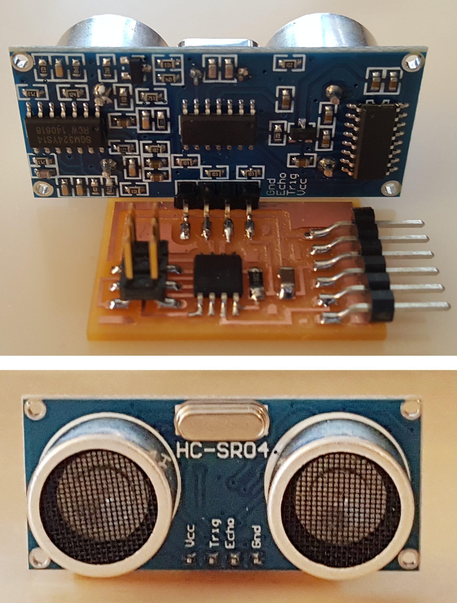
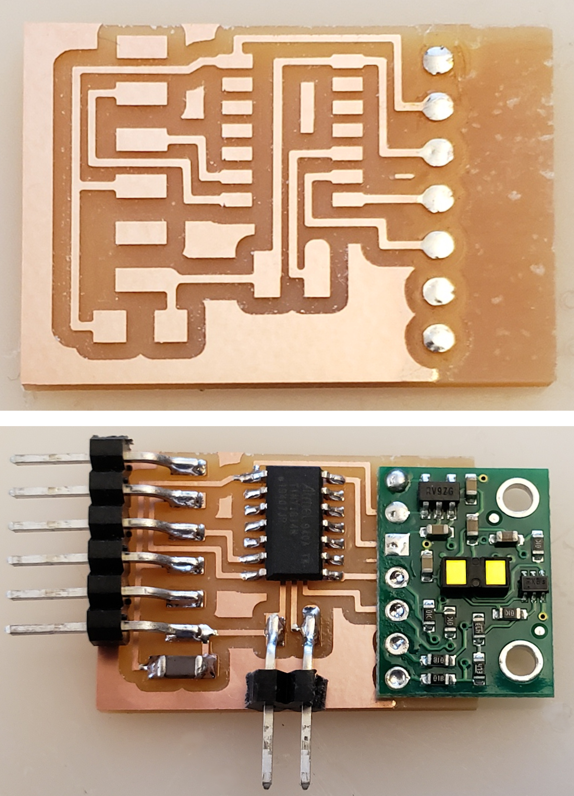
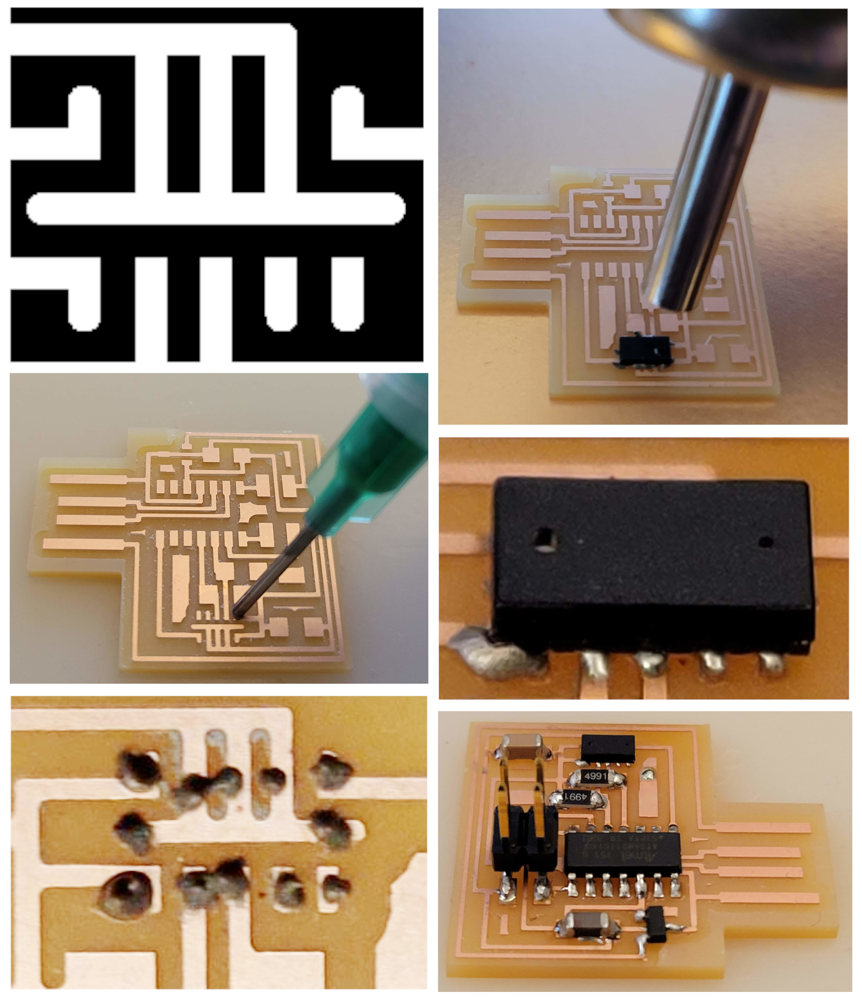

# Distance

---

## [Sonar](http://www.amazon.com/SunFouder-Ultrasonic-Distance-Mega2560-Duemilanove/dp/B00E0NXTJW)

### Hello HC-SR04 (2015)

  
///caption  
Components  
///

[hello.HC-SR04](sonar/hello.HC-SR04.cad) [board](sonar/hello.HC-SR04.png) [traces](sonar/hello.HC-SR04.traces.png) [interior](sonar/hello.HC-SR04.interior.png)  
[hello.HC-SR04.c](sonar/hello.HC-SR04.c) [hello.HC-SR04.make](sonar/hello.HC-SR04.make)  
[hello.HC-SR04.py](sonar/hello.HC-SR04.py) [video](sonar/hello.HC-SR04.mp4)

---

## Optical

### Hello VL53L1X (ATtiny1614) (2020)

  
///caption  
Components  
///

[board](https://www.digikey.com/en/products/detail/pololu-corporation/3415/10451121) [library](https://github.com/pololu/vl53l1x-arduino)  
[hello.VL53L1X.t1614](tof/hello.VL53L1X.t1614) [board](tof/hello.VL53L1X.t1614.png) [traces](tof/hello.VL53L1X.t1614.traces.png) [interior](tof/hello.VL53L1X.t1614.interior.png)  
[hello.VL53L1X.ino](tof/hello.VL53L1X.ino) [hello.VL53L1X.py](tof/hello.VL53L1X.py) [video](tof/hello.VL53L1X.mp4)

---

[LIDAR](https://www.amazon.com/s?k=lidar)

---

## Hello VL53L0X (2023)

  
///caption  
Components reflow  
///

[VL53L0X](https://www.digikey.com/en/products/detail/stmicroelectronics/VL53L0CXV0DH-1/6023691) [library](https://github.com/pololu/vl53l0x-arduino)  
[hello.VL53L0X.D11C](tof/hello.VL53L0X.D11C) [board](tof/hello.VL53L0X.D11C.png) [traces](tof/hello.VL53L0X.D11C.traces.png) [traces+exterior](tof/hello.VL53L0X.D11C.traces_exterior.png) [interior](tof/hello.VL53L0X.D11C.interior.png)  
[hello.VL53L0X.D11C.ino](tof/hello.VL53L0X.D11C.ino) [hello.VL53L0X.D11C.py](tof/hello.VL53L0X.D11C.py) [video](tof/hello.VL53L0X.D11C.mp4)

---

### Optical time of flight

[optical time-of-flight](http://www.digikey.com/product-detail/en/stmicroelectronics/VL53L0CXV0DH-1/497-16538-1-ND) [API](http://www.st.com/resource/en/user_manual/dm00279088.pdf)

### Lidar

[Lidar](https://www.amazon.com/s?k=lidar)