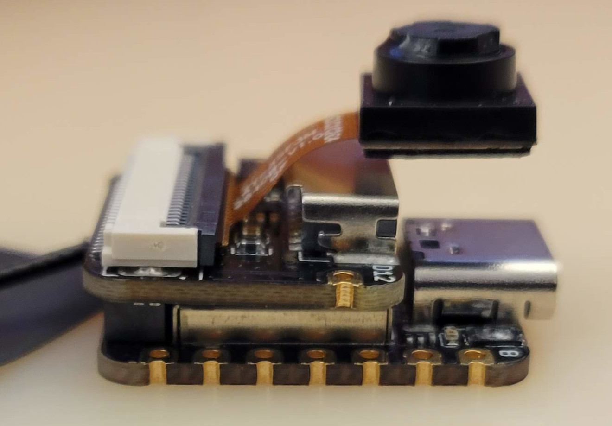
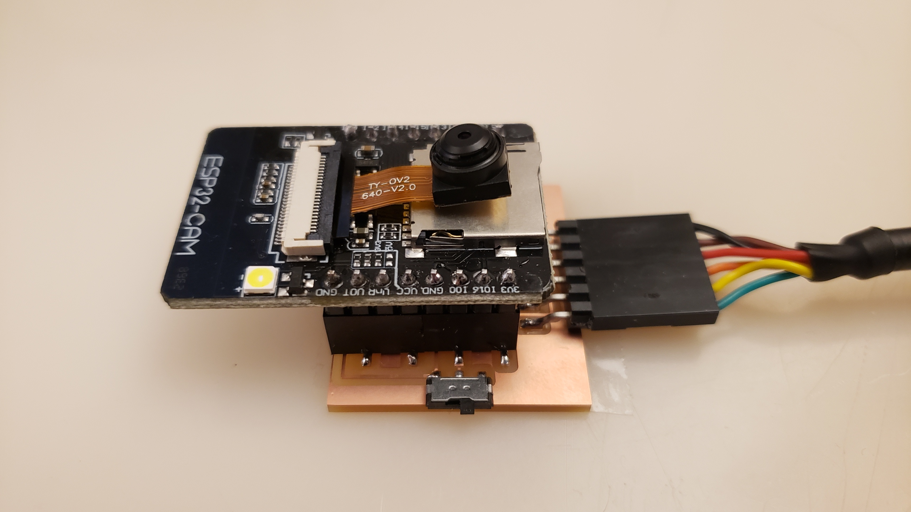

# Image

---

## ESP32

[ESP32](https://www.espressif.com/en/products/socs/esp32)  

### ESP32S3 XIAO Sense (2023)

  
///caption  
Module  
///

[ESP32S3 XIAO Sense](https://www.seeedstudio.com/XIAO-ESP32S3-Sense-p-5639.html)  
[camera](https://www.seeedstudio.com/OV5640-Camera-for-XIAO-ESP32S3-Sense-With-Heat-Sink-p-5739.html)  
[hello.ESP32-Sense.ino](image/hello.ESP32-Sense.ino) [video](image/hello.ESP32-Sense.mp4)  

---

### ESP32-CAM (2019)

  
///caption  
Components  
///

[ESP32-CAM](https://www.amazon.com/s?k=ESP32-CAM)  
[hello.ESP32-CAM](../networking_communications/ESP32/hello.ESP32-CAM) [board](../networking_communications/ESP32/hello.ESP32-CAM.png) [components](../networking_communications/ESP32/hello.ESP32-CAM.jpg) [traces](../networking_communications/ESP32/hello.ESP32-CAM.traces.png) [traces+exterior](../networking_communications/ESP32/hello.ESP32-CAM.traces_exterior.png) [holes](../networking_communications/ESP32/hello.ESP32-CAM.holes.png) [interior](../networking_communications/ESP32/hello.ESP32-CAM.interior.png)  
[camera](https://www.uctronics.com/download/cam_module/OV2640DS.pdf) [library](https://github.com/espressif/esp32-camera)  
[hello.ESP32-CAM.ino](../networking_communications/ESP32/hello.ESP32-CAM.ino) [video](../networking_communications/ESP32/hello.ESP32-CAM.video.mp4) [video](../networking_communications/ESP32/hello.ESP32-CAM.mp4)

### links

[AI module](https://wiki.seeedstudio.com/Grove-Vision-AI-Module/)  
[webcams](https://www.google.com/search?tbm=shop&q=webcam)  
[boards](https://www.google.com/search?tbm=shop&q=embedded+linux+board)  

Libraries:  
[OpenCV](http://opencv.org/)  
[OpenCV.js](https://github.com/ucisysarch/opencvjs)  
[SimpleCV](http://simplecv.org/)  
[libuvc](https://int80k.com/libuvc/doc/)  
[guvcview](http://guvcview.sourceforge.net/)  

[WebRTC](https://developer.mozilla.org/en-US/docs/Web/API/WebRTC_API)  
[video.html](https://academy.cba.mit.edu/classes/input_devices/video.html)  
[video](https://academy.cba.mit.edu/classes/input_devices/video.mp4)  

browser security
