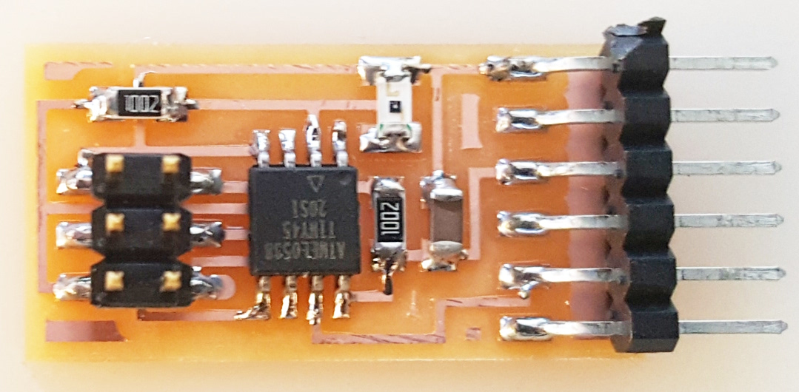
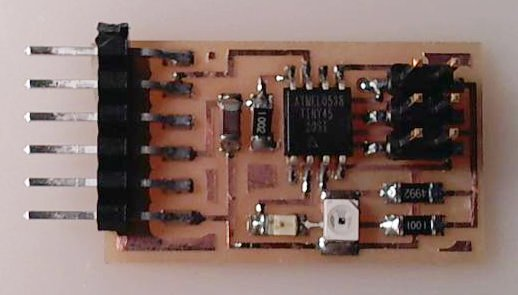
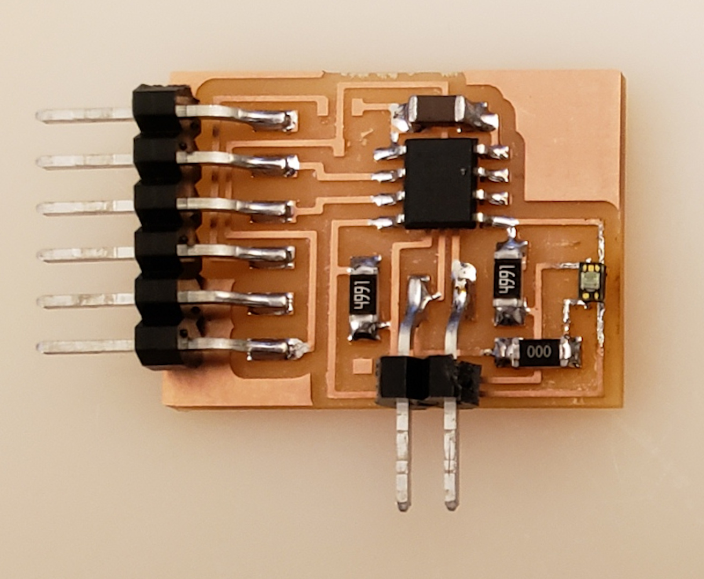

# Light

---

## Hello light 45 (2012)

  
///caption  
Components  
///

[hello.light.45.cad](light/hello.light.45.cad) [board](light/hello.light.45.png) [traces](light/hello.light.45.traces.png) [interior](light/hello.light.45.interior.png)  
[hello.light.45.c](light/hello.light.45.c) [makefile](light/hello.light.45.make)  
[hello.light.45.py](light/hello.light.45.py) [video](light/hello.light.45.mp4)

---

## Hello reflect 45 (2012)

  
///caption  
Components  
///

[hello.reflect.45.cad](light/hello.reflect.45.cad) [board](light/hello.reflect.45.png) [traces](light/hello.reflect.45.traces.png) [interior](light/hello.reflect.45.interior.png)  
[hello.reflect.45.c](light/hello.reflect.45.c) [makefile](light/hello.reflect.45.make)  
[hello.reflect.45.py](light/hello.reflect.45.py) [video](light/hello.reflect.45.mp4)

---

## Hello (color) VEML 6040 t412 (2020)

  
///caption  
Components  
///

[hello.VEML6040.t412](color/hello.VEML6040.t412) [board](color/hello.VEML6040.t412.png) [traces](color/hello.VEML6040.t412.traces.png) [interior](color/hello.VEML6040.t412.interior.png)  
[hello.VEML6040.ino](color/hello.VEML6040.ino) [hello.VEML6040.py](color/hello.VEML6040.py) [video](color/hello.VEML6040.mp4)

---

