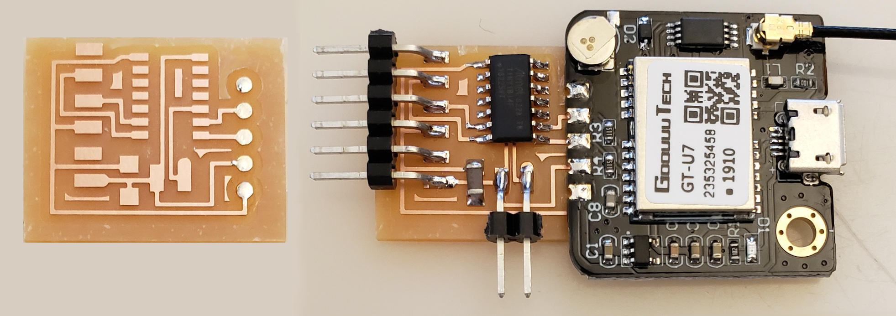

# Location, time

---

## Hello GPS t1614 (2021)

[GNSS](https://www.gps.gov/systems/gnss) [NMEA](https://gpsd.gitlab.io/gpsd/NMEA.html) [NEO-6](https://www.u-blox.com/sites/default/files/products/documents/NEO-6_DataSheet_(GPS.G6-HW-09005).pdf) [GT-U7](https://images-na.ssl-images-amazon.com/images/I/91tuvtrO2jL.pdf) [module](https://www.amazon.com/Microcontroller-Compatible-Sensitivity-Navigation-Positioning/dp/B07P8YMVNT)  

  
///caption  
Components  
///

[hello.GPS.t1614](GPS/hello.GPS.t1614) [board](GPS/hello.GPS.t1614.png) [components](GPS/hello.GPS.t1614.jpg) [traces](GPS/hello.GPS.t1614.traces.png) [interior](GPS/hello.GPS.t1614.interior.png)  
[hello.GPS.t1614.ino](GPS/hello.GPS.t1614.ino) [video](GPS/hello.GPS.t1614.mp4)
