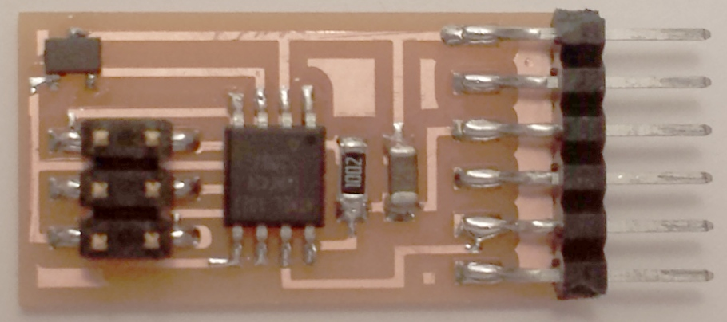
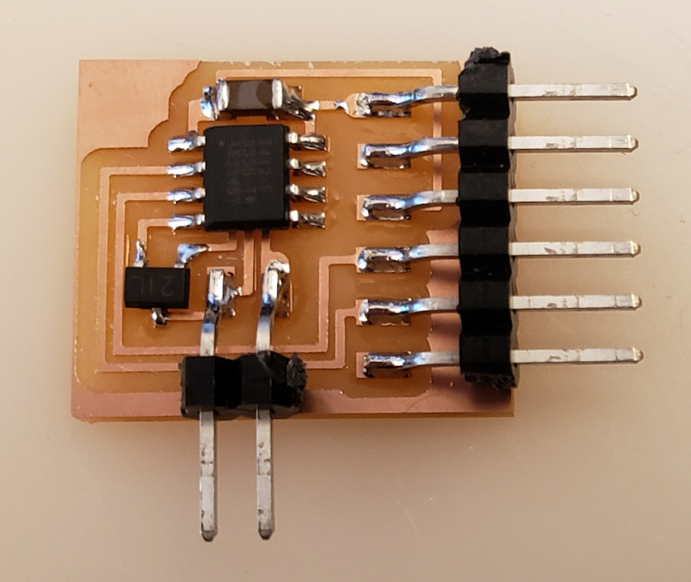
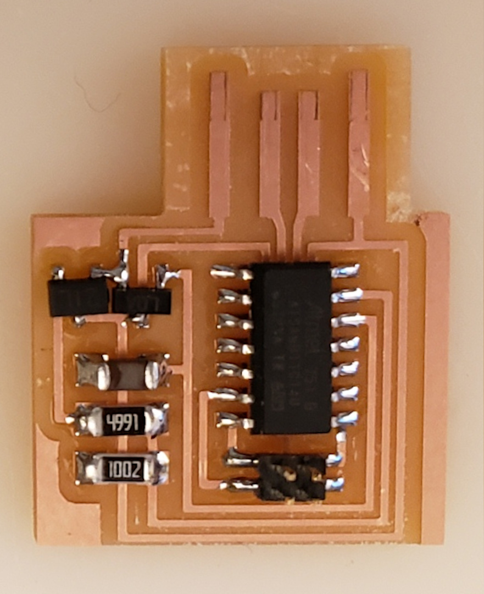
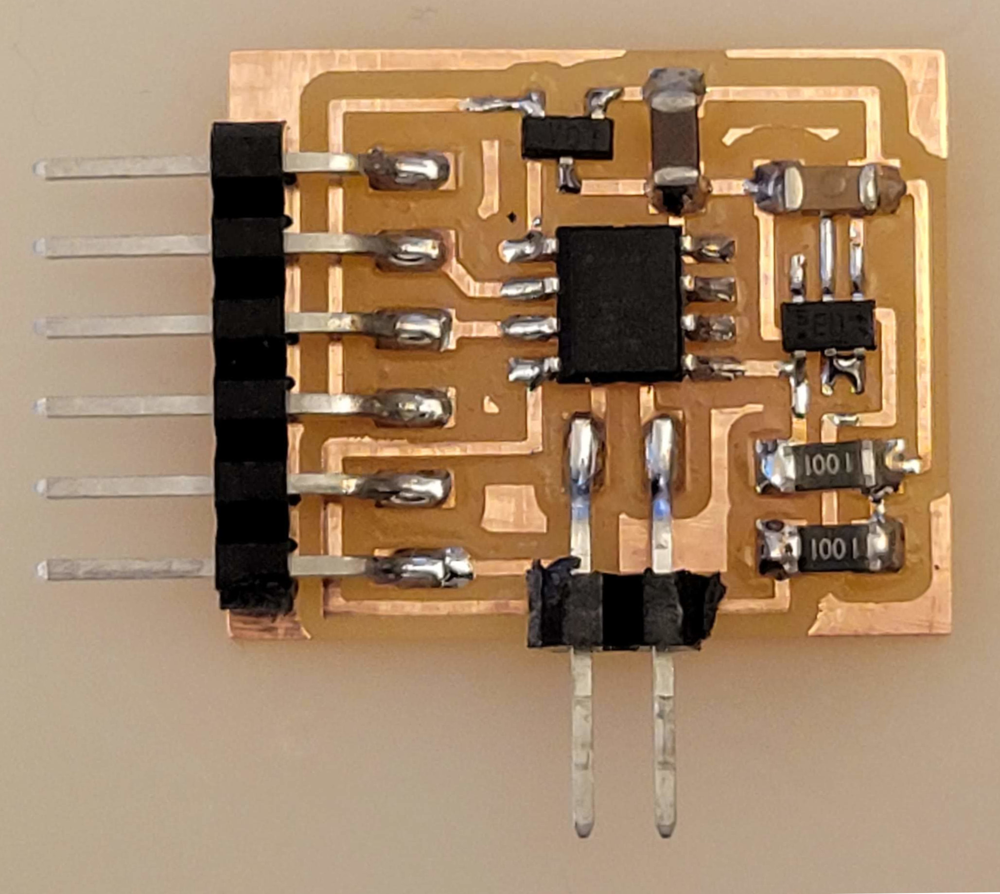

# Magnetic field

---

[Hall effect](http://www.digikey.com/product-detail/en/A1324LLHLT-T/620-1402-1-ND/)
[array](https://www.digikey.com/product-detail/en/ams/AS5013-IQFT/AS5013-IQFT-1000CT-ND)

---

## Hello mag 45 (2013)

///caption  
Components  
///

[hello.mag.45](mag/hello.mag.45) [board](mag/hello.mag.45.png) [traces](mag/hello.mag.45.traces.png) [interior](mag/hello.mag.45.interior.png)  
[hello.mag.45.c](mag/hello.mag.45.c) [makefile](mag/hello.mag.45.make)  
[hello.mag.45.py](mag/hello.mag.45.py)  
[hello.mag.45.html](mag/hello.mag.45.html) [hello.mag.45.js](mag/hello.mag.45.js) [mods](mag/hello.mag.45.mods.mp4)  
[video](mag/hello.mag.45.mp4)

---

## Hello mag t412 (2020)

///caption  
Components  
///

[hello.mag.t412](mag/hello.mag.t412) [board](mag/hello.mag.t412.png) [traces](mag/hello.mag.t412.traces.png) [interior](mag/hello.mag.t412.interior.png)  
[hello.mag.serial.ino](mag/hello.mag.serial.ino) [hello.mag.t412.ino](mag/hello.mag.t412.ino)

---

## Hello mag D11C (2020)

///caption  
Components  
///

[hello.mag.D11C](mag/hello.mag.D11C) [board](mag/hello.mag.D11C.png) [traces](mag/hello.mag.D11C.traces.png) [interior](mag/hello.mag.D11C.interior.png)  
[hello.mag.USB.ino](mag/hello.mag.USB.ino) [hello.mag.D11C.ino](mag/hello.mag.D11C.ino)

---

## Hello TLE4938 t412 (2021)

[Vector](https://www.digikey.com/en/products/detail/infineon-technologies/TLE493DA2B6HTSA1/9808570)
[Applications](https://www.infineon.com/dgdl/Infineon-3D_Magnetic_Sensors-ProductBrief-v05_00-EN.pdf?fileId=5546d46261d5e6820161e7571b2b3dd0)
[Simulation](https://design.infineon.com/3dsim/)

///caption  
Components  
///

[hello.TLE493D.t412](mag/TLE493D/hello.TLE493D.t412) 
[board](mag/TLE493D/hello.TLE493D.t412.png) 
[traces](mag/TLE493D/hello.TLE493D.t412.traces.png) 
[interior](mag/TLE493D/hello.TLE493D.t412.interior.png)  
[hello.TLE493D.t412.ino](mag/TLE493D/hello.TLE493D.t412.ino) 
[hello.TLE493D.t412.c](mag/TLE493D/hello.TLE493D.t412.c) 
[makefile](mag/TLE493D/hello.TLE493D.t412.make) 
[hello.TLE493D.t412.py](mag/TLE493D/hello.TLE493D.t412.py)  
[video](mag/TLE493D/hello.TLE493D.t412.mp4)