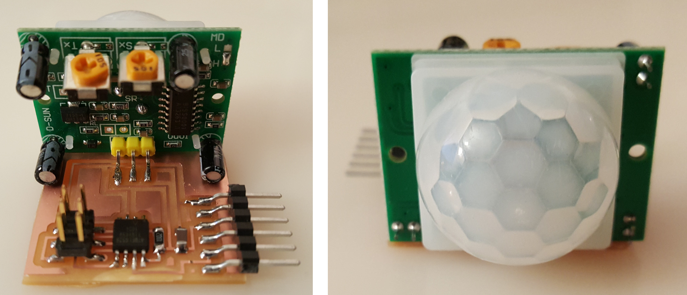
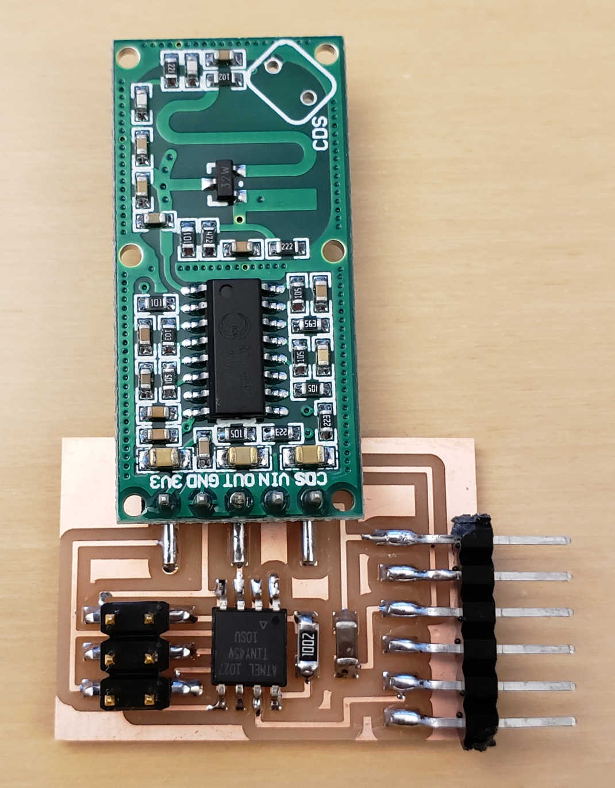

# Motion

---

## Pyroelectric

### Hello HC-SR501 (2015)

[pyroelectric](http://www.amazon.com/J-deal%C2%AE-Pyroelectric-Infrared-Detector-Hc-sr501/dp/B013LA6MW0)

  
///caption  
Components  
///

[hello.HC-SR501](motion/hello.HC-SR501) [board](motion/hello.HC-SR501.png) [traces](motion/hello.HC-SR501.traces.png) [interior](motion/hello.HC-SR501.interior.png)  
[hello.HC-SR501.cad](motion/hello.HC-SR501.cad) [hello.HC-SR501.c](motion/hello.HC-SR501.c) [hello.HC-SR501.make](motion/hello.HC-SR501.make)  
[hello.HC-SR501.py](motion/hello.HC-SR501.py) [video](motion/hello.HC-SR501.mp4)

---

## Doppler Radar

### Hello RCWL 0516 (2019)

[Doppler Radar RCWL-0516](https://www.amazon.com/RCWL-0516-Detection-Microwave-Raspberry-Detector/dp/B07GCHY9K6)

  
///caption  
Components  
///

[hello.RCWL-0516](radar/hello.RCWL-0516) [board](radar/hello.RCWL-0516.png) [traces](radar/hello.RCWL-0516.traces.png) [interior](radar/hello.RCWL-0516.interior.png)  
[hello.RCWL-0516.c](radar/hello.RCWL-0516.c) [hello.RCWL-0516.make](radar/hello.RCWL-0516.make)  
[hello.RCWL-0516.py](radar/hello.RCWL-0516.py) [video](radar/hello.RCWL-0516.mp4)

---

