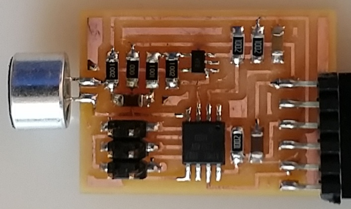
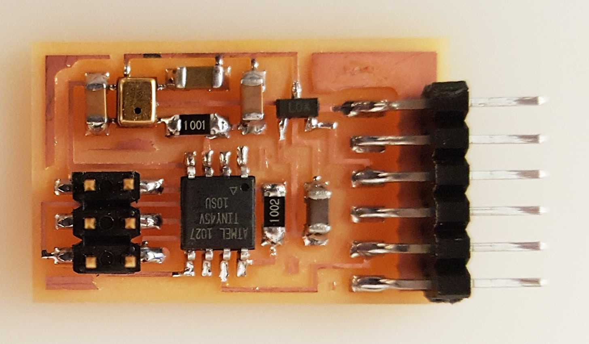
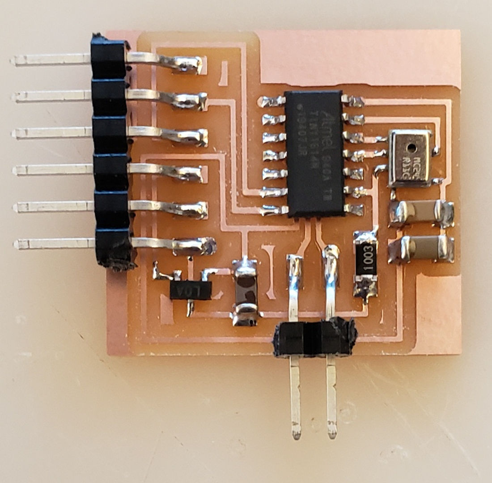
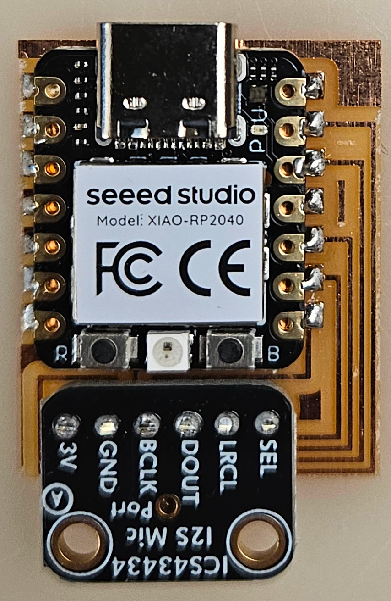

# Sound

---

## Hello mic 45 (2012)

  
///caption  
Components  
///

[hello.mic.45.cad](mic/hello.mic.45.cad) [board](mic/hello.mic.45.png) [traces](mic/hello.mic.45.traces.png) [interior](mic/hello.mic.45.interior.png)  
[hello.mic.45.c](mic/hello.mic.45.c) [makefile](mic/hello.mic.45.make)  
[hello.mic.45.py](mic/hello.mic.45.py) [video](mic/hello.mic.45.mp4)

---

## Hello SPU0414HR5H (2015)

  
///caption  
Components  
///

[hello.SPU0414HR5H.cad](mic/hello.SPU0414HR5H.cad) [board](mic/hello.SPU0414HR5H.png) [traces](mic/hello.SPU0414HR5H.traces.png) [interior](mic/hello.SPU0414HR5H.interior.png)  
[hello.SPU0414HR5H.c](mic/hello.SPU0414HR5H.c) [makefile](mic/hello.SPU0414HR5H.make)  
[hello.SPU0414HR5H.py](mic/hello.SPU0414HR5H.py) [video](mic/hello.SPU0414HR5H.mp4)

---

## Hello CMM-4030D-261-I2S-TR t1614 (2020)

  
///caption  
Components  
///

[hello.CMM-4030D-261-I2S-TR.t1614](mic/hello.CMM-4030D-261-I2S-TR.t1614) [board](mic/hello.CMM-4030D-261-I2S-TR.t1614.png) [traces](mic/hello.CMM-4030D-261-I2S-TR.t1614.traces.png) [interior](mic/hello.CMM-4030D-261-I2S-TR.t1614.interior.png)  
[hello.CMM-4030D-261-I2S-TR.ino](mic/hello.CMM-4030D-261-I2S-TR.ino) [hello.CMM-4030D-261-I2S-TR.py](mic/hello.CMM-4030D-261-I2S-TR.py) [video](mic/hello.CMM-4030D-261-I2S-TR.mp4)

---

## Hello ICS-43434 RP2040 (2024)

  
///caption  
Components  
///

[hello.ICS-43434.RP2040](mic/I2S/hello.ICS-43434.RP2040) [board](mic/I2S/hello.ICS-43434.RP2040.png) [traces](mic/I2S/hello.ICS-43434.RP2040.top.png) [holes](mic/I2S/hello.ICS-43434.RP2040.holes.png) [interior](mic/I2S/hello.ICS-43434.RP2040.interior.png)  
[hello.ICS-43434.RP2040.ino](mic/I2S/hello.ICS-43434.RP2040.ino) [hello.ICS-43434.RP2040.py](mic/I2S/hello.ICS-43434.RP2040.py) [video](mic/I2S/hello.ICS-43434.RP2040.mp4)

---