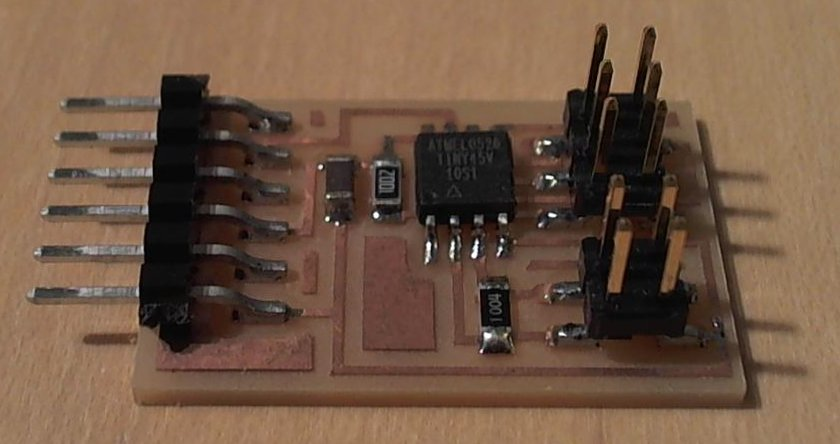
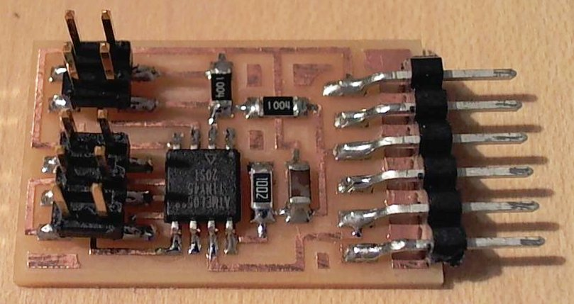
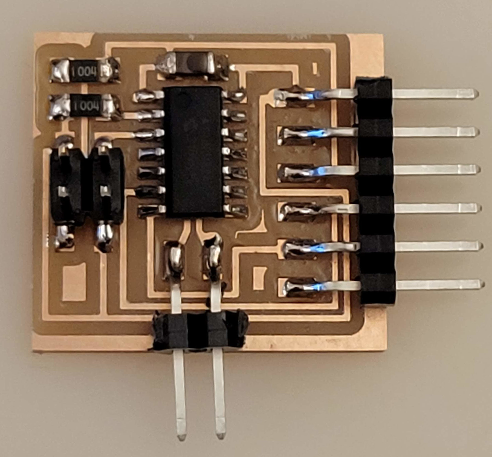
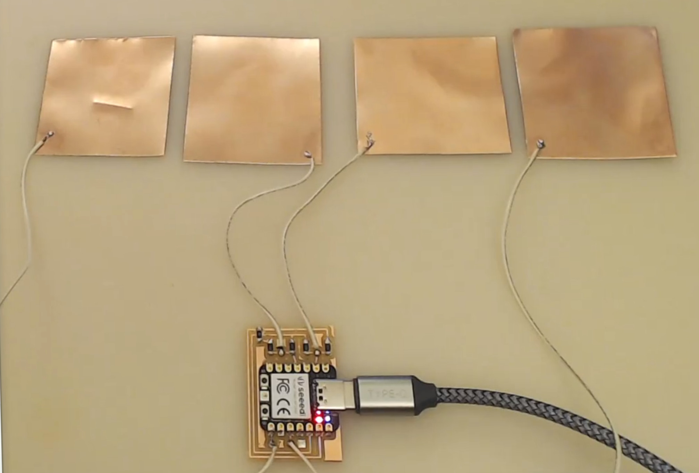
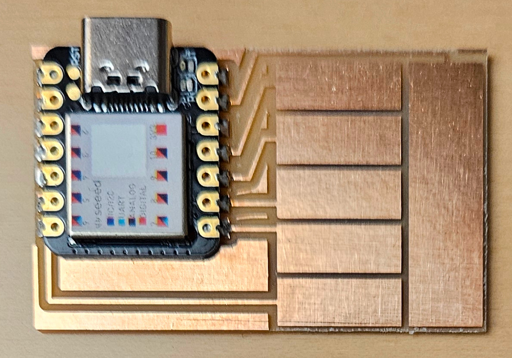
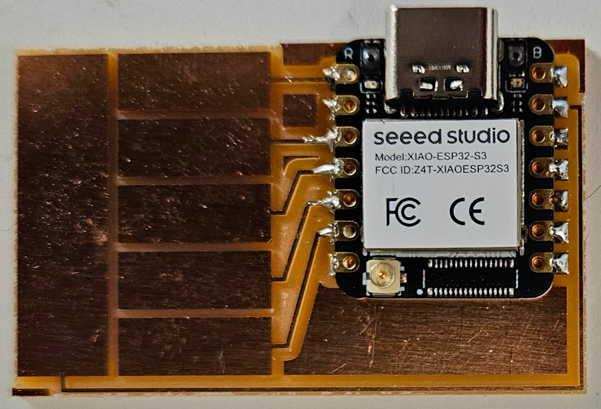
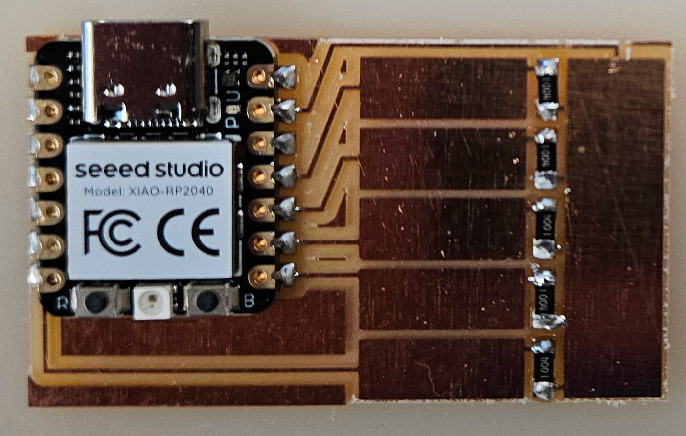
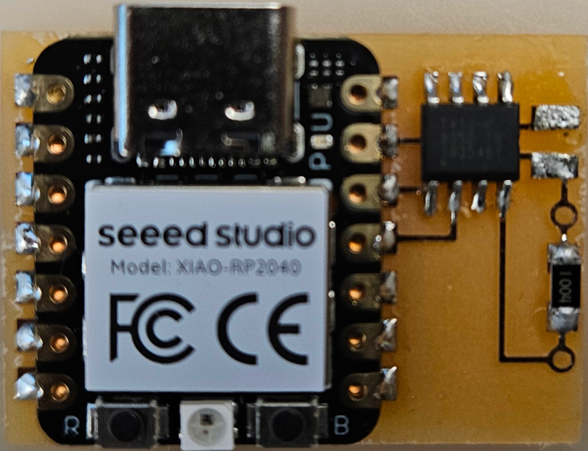
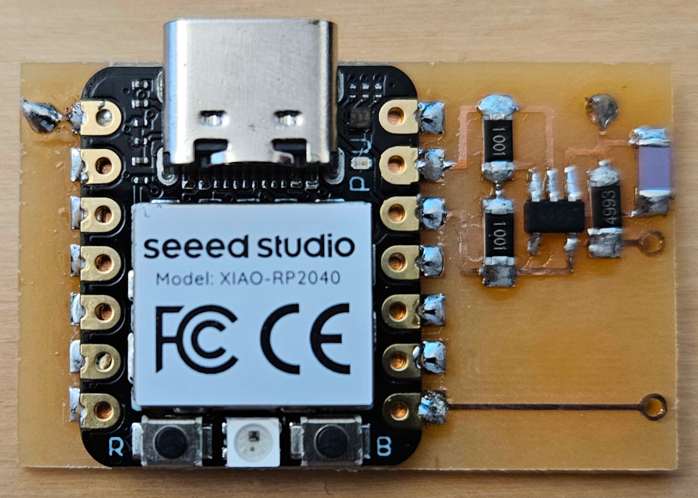

# Step response

---

## Hello load 45 (2012)

///caption  
Components  
///

[hello.load.45.cad](step/hello.load.45.cad) 
[board](step/hello.load.45.png) 
[traces](step/hello.load.45.traces.png) 
[interior](step/hello.load.45.interior.png)  
[hello.load.45.c](step/hello.load.45.c) 
[makefile](step/hello.load.45.make)  
[hello.load.45.py](step/hello.load.45.py)  
[video](step/hello.load.45.mp4)

---

## Hello TXRX 45 (2012)

///caption  
Components  
///

[hello.txrx.45.cad](step/hello.txrx.45.cad) [board](step/hello.txrx.45.png) [traces](step/hello.txrx.45.traces.png) [interior](step/hello.txrx.45.interior.png)  
[hello.txrx.45.c](step/hello.txrx.45.c) [makefile](step/hello.txrx.45.make)  
[hello.txrx.45.py](step/hello.txrx.45.py)  
[video](step/hello.txrx.45.mp4)
[dielectric spectroscopy](DS.pdf)  
[measurement](meas.pdf)

---

## Hello TXRX t1624 (2021)

///caption  
Components  
///

[hello.txrx.t1624](step/hello.txrx.t1624) [board](step/hello.txrx.t1624.png) [traces](step/hello.txrx.t1624.traces.png) [interior](step/hello.txrx.t1624.interior.png)  
[hello.txrx.t1624.ino](step/hello.txrx.t1624.ino) [hello.txrx.t1624.py](step/hello.txrx.t1624.py)  
[video](step/hello.txrx.t1624.mp4)

---

## Hello TXRX RP2040 (2023)

///caption  
Components  
///

[hello.txrx2.RP2040](step/hello.txrx2.RP2040) [board](step/hello.txrx2.RP2040.png) [traces](step/hello.txrx2.RP2040.traces.png) [holes](step/hello.txrx2.RP2040.holes.png) [interior](step/hello.txrx2.RP2040.interior.png)  
[hello.txrx2.RP2040.ino](step/hello.txrx2.RP2040.ino)  
[video](step/hello.txrx2.RP2040.mp4)

---

## Hello Touch D21 (2024)

///caption  
Components  
///

[hello.touch.D21](step/D21/hello.touch.D21) [board](step/D21/hello.touch.D21.png) [traces](step/D21/hello.touch.D21.top.png) [interior](step/D21/hello.touch.D21.interior.png)  
[hello.touch.D21.ino](step/D21/hello.touch.D21.ino)  
[video](step/D21/hello.touch.D21.mp4)

---

## Hello Touch S3 (2024)

///caption  
Components  
///

[hello.touch.S3](step/ESP32S3/hello.touch.S3) [board](step/ESP32S3/hello.touch.S3.png) [top](step/ESP32S3/hello.touch.S3.top.png) [interior](step/ESP32S3/hello.touch.S3.interior.png)  
[hello.touch.S3.py](step/ESP32S3/hello.touch.S3.py)  
[video](step/ESP32S3/hello.touch.S3.mp4)

---

## Hello Steptime1 RP2040 (2024)

///caption  
Components  
///

[hello.steptime1.RP2040](step/RP2040/hello.steptime1.RP2040) [board](step/RP2040/hello.steptime1.RP2040.png) [traces](step/RP2040/hello.steptime1.RP2040.top.png) [interior](step/RP2040/hello.steptime1.RP2040.interior.png)  
[hello.steptime1.RP2040.py](step/RP2040/hello.steptime1.RP2040.py)  
[video](step/RP2040/hello.steptime1.RP2040.mp4)

---

## Hello Load RP2040 t412 (2024)

///caption  
Components  
///

[hello.load.RP2040.t412](step/t412/hello.load.RP2040.t412) [board](step/t412/hello.load.RP2040.t412.png) [traces](step/t412/hello.load.RP2040.t412.top.png) [holes](step/t412/hello.load.RP2040.t412.holes.png) [interior](step/t412/hello.load.RP2040.t412.interior.png)  
[hello.load.RP2040.py](step/t412/hello.load.RP2040.py) [hello.load.t412.ino](step/t412/hello.load.t412.ino)  
[video](step/t412/hello.load.RP2040.t412.mp4)

---

## Hello TXRX2 RP2040 (2024)

///caption  
Components  
///

[hello.txrx2.RP2040](step/hello.txrx2.RP2040) [board](step/hello.txrx2.RP2040.png) [traces](step/hello.txrx2.RP2040.traces.png) [holes](step/hello.txrx2.RP2040.holes.png) [interior](step/hello.txrx2.RP2040.interior.png)  
[hello.txrx2.RP2040.ino](step/hello.txrx2.RP2040.ino)  
[video](step/hello.txrx2.RP2040.mp4)

---

## Hello TXRX RP2040 OP-AMP (2024)

///caption  
Components  
///

[hello.txrx.RP2040.op-amp](step/RP2040/hello.txrx.RP2040.op-amp) [board](step/RP2040/hello.txrx.RP2040.op-amp.png) [traces](step/RP2040/hello.txrx.RP2040.op-amp.top.png) [holes](step/RP2040/hello.txrx.RP2040.op-amp.holes.png) [interior](step/RP2040/hello.txrx.RP2040.op-amp.interior.png)  
[hello.txrx.RP2040.op-amp.ino](step/RP2040/hello.txrx.RP2040.op-amp.ino)  
[video](step/RP2040/hello.txrx.RP2040.op-amp.mp4)