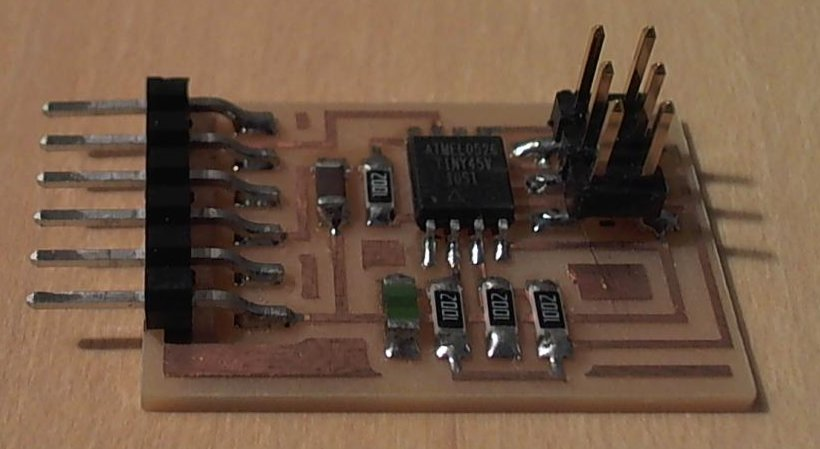

# Temperature

---

## Hello temp 45 (2014)

  
///caption  
Components  
///

[hello.temp.45.cad](temp/hello.temp.45.cad) [board](temp/hello.temp.45.png) [traces](temp/hello.temp.45.traces.png) [interior](temp/hello.temp.45.interior.png)  
[hello.temp.45.c](temp/hello.temp.45.c) [makefile](temp/hello.temp.45.make)  
[hello.temp.45.py](temp/hello.temp.45.py) [video](temp/hello.temp.45.mp4)

---