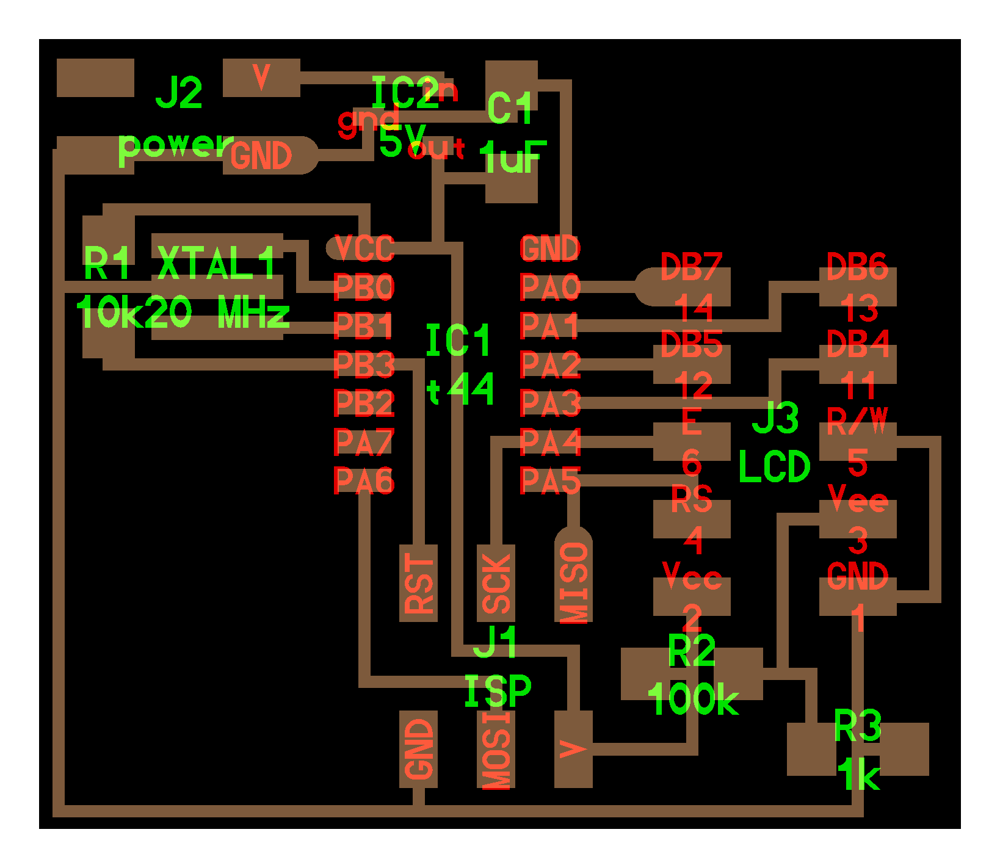

# LCD

---

## Examples

### hello.LCD.44 (2012 – 2018)

///caption
Components
///
[hello.LCD.44.cad](LCD/hello.LCD.44.cad) [board](LCD/hello.LCD.44.png) [components](LCD/hello.LCD.44.jpg) [traces](LCD/hello.LCD.44.traces.png) [interior](LCD/hello.LCD.44.interior.png) [C](LCD/hello.LCD.44.c) [makefile](LCD/hello.LCD.44.make) [video](LCD/hello.LCD.44.mp4)
---

## Talking points

[44780](44780.pdf) (2012 – 2018)  
[serial](http://www.digikey.com/product-detail/en/NHD-0216K3Z-FL-GBW-V3/NHD-0216K3Z-FL-GBW-V3-ND) (2015 – 2017)  
[color](https://www.adafruit.com/category/63) (2017)  
[OLED](https://www.amazon.com/s/keywords=oled+module) (2018)  
[E Ink](https://www.eink.com) (2018)  
