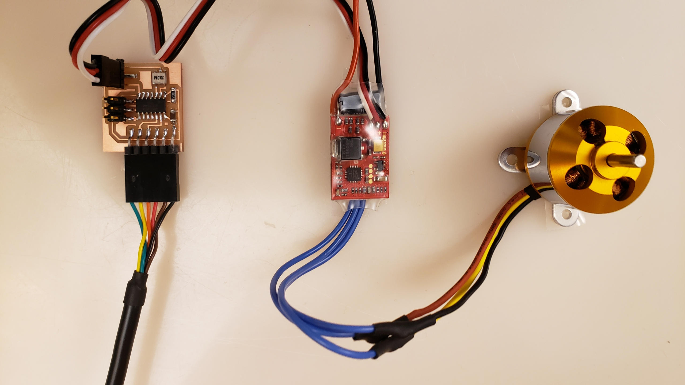
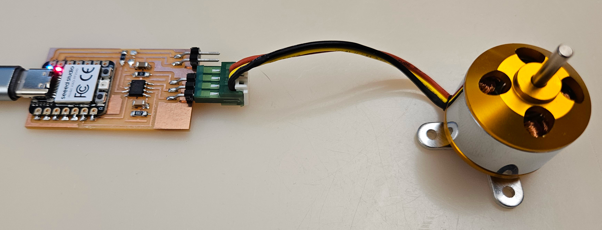

# Brushless DC Motor (BLDC)

---

## Examples

### hello.ESC.44 (2019 – 2025)

///caption  
ESC board & components  
///
[hello.ESC.44](ESC/hello.ESC.44) [board](ESC/hello.ESC.44.png) [components](ESC/hello.ESC.44.jpg) [traces](ESC/hello.ESC.44.traces.png) [traces+exterior](ESC/hello.ESC.44.traces_exterior.png) [interior](ESC/hello.ESC.44.interior.png) [C](ESC/hello.ESC.44.c) [makefile](ESC/hello.ESC.44.make) [video](ESC/hello.ESC.44.mp4)

---

### hello.A4949.RP2040 (2024 – 2025)

///caption  
Components  
///
[hello.A4949.RP2040](BLDC/hello.A4949.RP2040) [board](BLDC/hello.A4949.RP2040.png) [components](BLDC/hello.A4949.RP2040.jpg) [top](BLDC/hello.A4949.RP2040.top.png) [interior](BLDC/hello.A4949.RP2040.interior.png) [hello.A4949.RP2040.py](BLDC/hello.A4949.RP2040.py) [video](BLDC/hello.A4949.RP2040.mp4)

---

## Talking points

[inrunner, outrunner, pancake, fan](https://hobbyking.com/en_us/electric-motors-1.html) (2016, 2023 – 2025)  
[A4941](http://www.digikey.com/product-detail/en/allegro-microsystems-llc/A4941GLPTR-T/620-1357-1-ND) (2016)  
[A4963](http://www.digikey.com/product-detail/en/allegro-microsystems-llc/A4963GLPTR-T/620-1686-1-ND) (2016)  
[electronic speed controller (ESC)](http://www.hobbyking.com/hobbyking/store/__61__182__Speed_Controllers_ESC_-All_Speed_Controllers.html) (2016)  
[firmware](https://github.com/sim-/tgy) (2016, 2019 – 2025)  
[efficiency, density, reliability, noise] (2016, 2023 – 2025)  
[Kv (RPM/V)] (2016, 2023 – 2025)  
[triple half-bridge] (2016, 2023 – 2025)  
[drive waveform] (2016, 2023 – 2025)  
[open-loop, closed-loop control] (2016, 2023 – 2025)  
[back EMF (BEMF) sensing] (2016, 2023 – 2025)  
[servo PWM] (2016, 2023 – 2025)  
[initialization, calibration] (2016, 2023 – 2025)  
[LiPo 3.7V cells] (2016)  
[DRV11873](https://www.digikey.com/en/products/detail/texas-instruments/DRV11873PWPR/3903327) (2023)  
[electronic speed controller (ESC)](https://www.amazon.com/s?k=esc+electronic+speed+controller) (2019 – 2025)  
[A4949](https://www.digikey.com/en/products/detail/allegro-microsystems/A4949GLJTR-6-T/5014632) (2024 – 2025)  
[phases/rotation (6 typical)] (2024 – 2025)  
[power input, output] (2023 – 2025)  
[~1, 10, 100, 1000 A, \$] (2016, 2023 – 2025)

---

