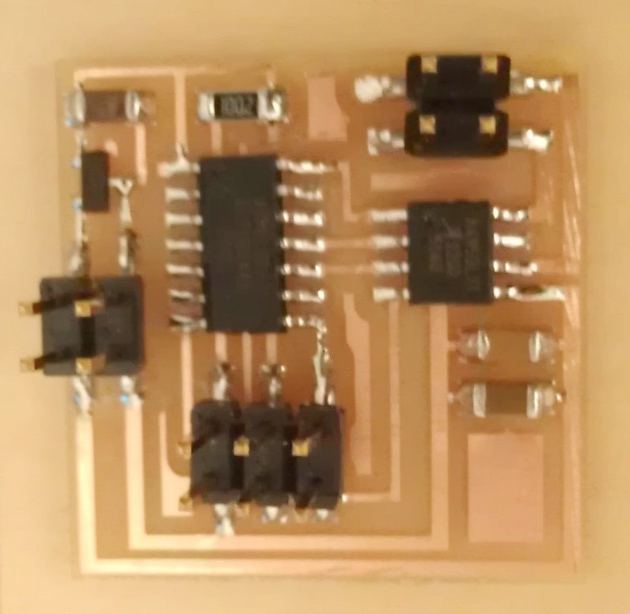
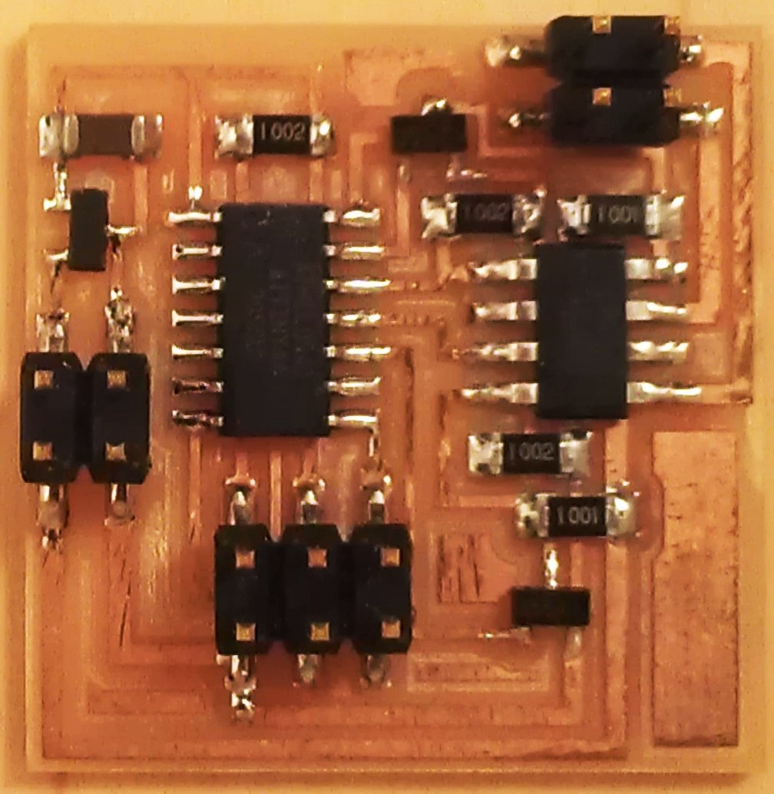
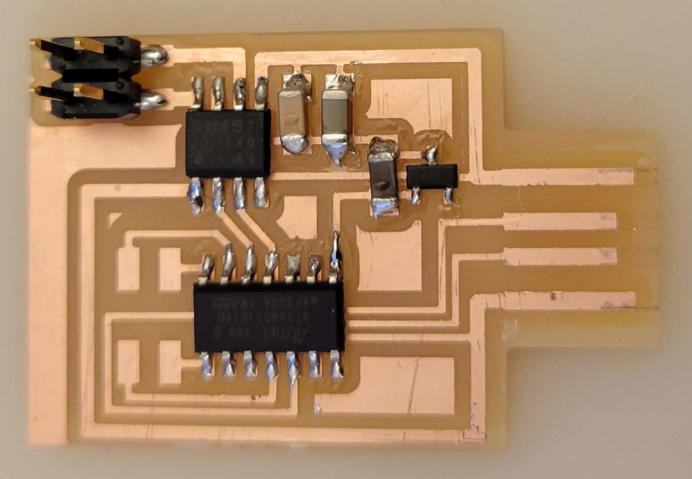
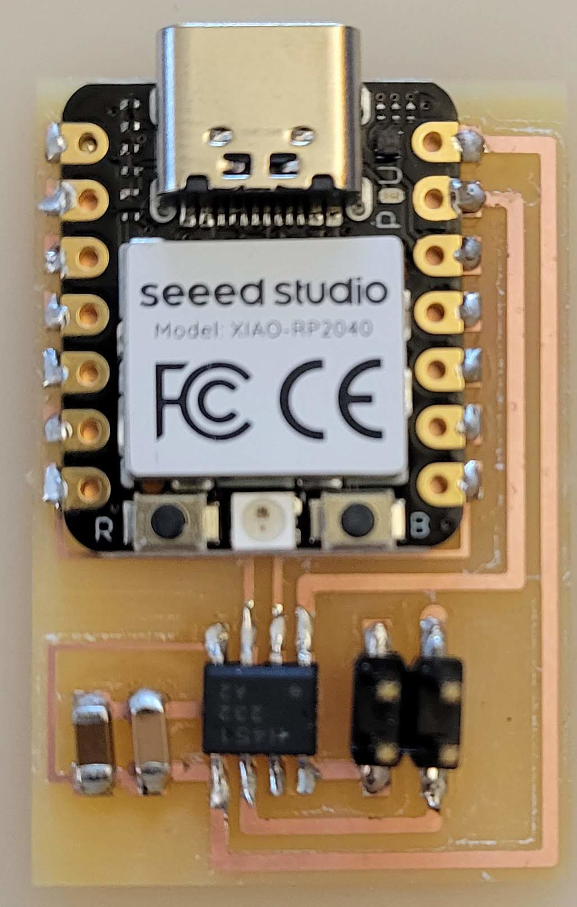
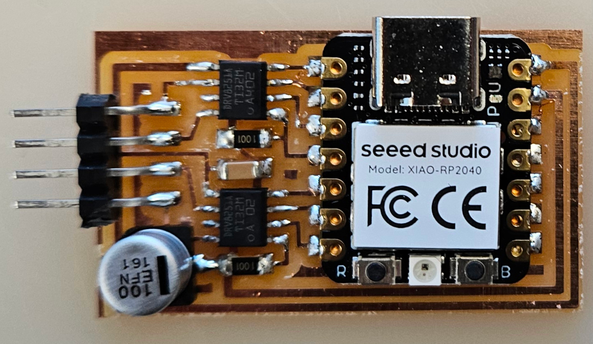

# DC Motor

---

## Examples

### hello.H-bridge.44 (2012 – 2021)

///caption
Components
///
[hello.H-bridge.44.cad](H-bridge/hello.H-bridge.44.cad) [board](H-bridge/hello.H-bridge.44.png) [components](H-bridge/hello.H-bridge.44.jpg) [traces](H-bridge/hello.H-bridge.44.traces.png) [interior](H-bridge/hello.H-bridge.44.interior.png) [C](H-bridge/hello.H-bridge.44.c) [makefile](H-bridge/hello.H-bridge.44.make) [video](H-bridge/hello.H-bridge.44.avi)

---

### hello.H-bridge.44.Zetex (2012 – 2013)

///caption
Components
///
[hello.H-bridge.44.Zetex.cad](H-bridge/hello.H-bridge.44.Zetex.cad) [board](H-bridge/hello.H-bridge.44.Zetex.png) [components](H-bridge/hello.H-bridge.44.Zetex.jpg) [traces](H-bridge/hello.H-bridge.44.Zetex.traces.png) [interior](H-bridge/hello.H-bridge.44.Zetex.interior.png) [C](H-bridge/hello.H-bridge.44.Zetex.c)

---

### hello.H-bridge.44.DC (2014 – 2024)
<!-- No components image, so omit image and caption -->
[hello.H-bridge.44.DC.c](DC/hello.H-bridge.44.DC.c) [makefile](DC/hello.H-bridge.44.DC.make) [video](DC/hello.H-bridge.44.DC.mp4)

---

### hello.H-bridge.D11C (2022 – 2025)

///caption
Components
///
[hello.H-bridge.D11C](H-bridge/hello.H-bridge.D11C) [board](H-bridge/hello.H-bridge.D11C.png) [components](H-bridge/hello.H-bridge.D11C.jpg) [traces](H-bridge/hello.H-bridge.D11C.traces.png) [traces+exterior](H-bridge/hello.H-bridge.D11C.traces_exterior.png) [interior](H-bridge/hello.H-bridge.D11C.interior.png) [hello.H-bridge.D11C.ino](H-bridge/hello.H-bridge.D11C.ino) [video](H-bridge/hello.H-bridge.D11C.mp4)

---

### hello.TB67H451.RP2040 (2023 – 2025)

///caption
Components
///
[hello.TB67H451.RP2040](H-bridge/hello.TB67H451.RP2040) [board](H-bridge/hello.TB67H451.RP2040.png) [components](H-bridge/hello.TB67H451.RP2040.jpg) [top](H-bridge/hello.TB67H451.RP2040.top.png) [interior](H-bridge/hello.TB67H451.RP2040.interior.png) [hello.TB67H451.RP2040.ino](H-bridge/hello.TB67H451.RP2040.ino) [hello.TB67H451.RP2040.py](H-bridge/hello.TB67H451.RP2040.py) [boot.py](H-bridge/boot.py) [video](H-bridge/hello.TB67H451.RP2040.mp4)

---

### hello.DRV8251A.RP2040 (2024 – 2025)

///caption
Components
///
[hello.DRV8251A.RP2040](H-bridge/DRV8251A/hello.DRV8251A.RP2040) [board](H-bridge/DRV8251A/hello.DRV8251A.RP2040.png) [components](H-bridge/DRV8251A/hello.DRV8251A.RP2040.jpg) [top](H-bridge/DRV8251A/hello.DRV8251A.RP2040.top.png) [interior](H-bridge/DRV8251A/hello.DRV8251A.RP2040.interior.png)

---

## Talking points

[DC motors at Jameco](https://www.jameco.com/webapp/wcs/stores/servlet/StoreCatalogDrillDownView?langId=-1&storeId=10001&catalogId=10001&categoryName=cat_3515&subCategoryName=Electromechanical%20%2F%20Motors%20%2F%20DC%20Direct%20Drive&category=351530)  
[H-bridge: A4953](http://www.digikey.com/product-detail/en/A4953ELJTR-T/620-1428-1-ND/2765622), [A4950](http://www.digikey.com/product-detail/en/allegro-microsystems-llc/A4950ELJTR-T/620-1400-1-ND), [DRV8838](http://www.ti.com/product/DRV8838), [DRV8251A](https://www.digikey.com/en/products/detail/texas-instruments/DRV8251ADDAR/16182453?s=N4IgTCBcDaICYCcBuAOMBWAjAQxAXQF8g), [TB67H451FNG,EL](https://www.digikey.com/en/products/detail/toshiba-semiconductor-and-storage/TB67H451FNG-EL/11568781), [DRV8847](https://www.digikey.com/en/products/detail/texas-instruments/DRV8847PWPR/9954204)  
torque, power, efficiency, gearing  
[DC vibration motor](http://www.jameco.com/webapp/wcs/stores/servlet/Product_10001_10001_256314_-1), [amazon search](https://www.amazon.com/s?k=vibration+motor)  
[thermal: heatsinks](https://www.digikey.com/en/products/filter/thermal-heat-sinks/219)  
gearhead, outrunner, brushless

---
