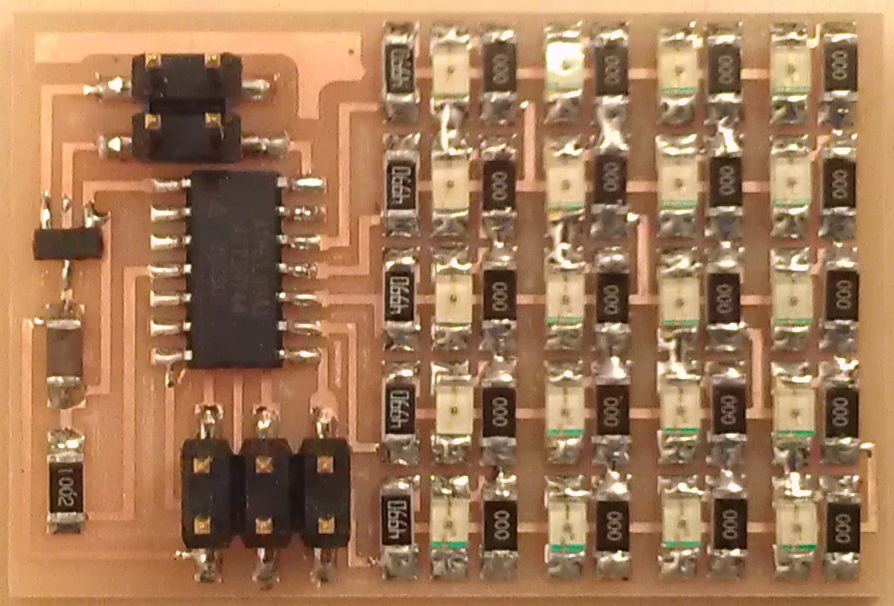
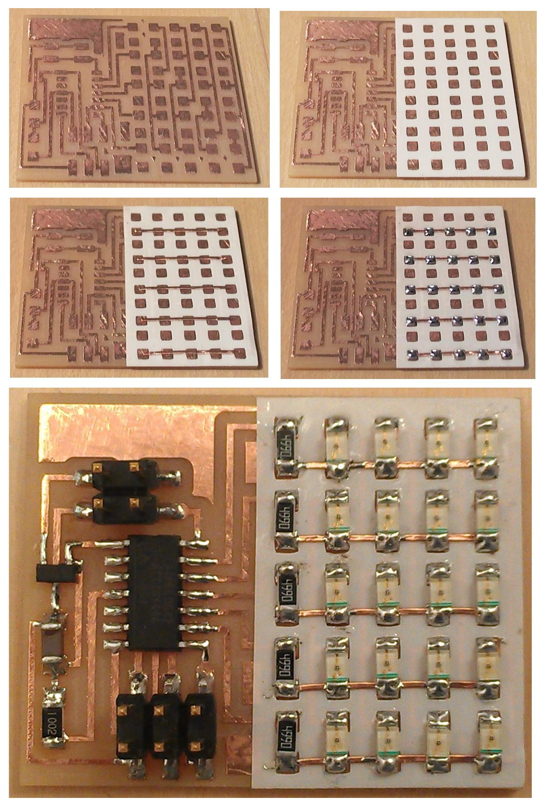
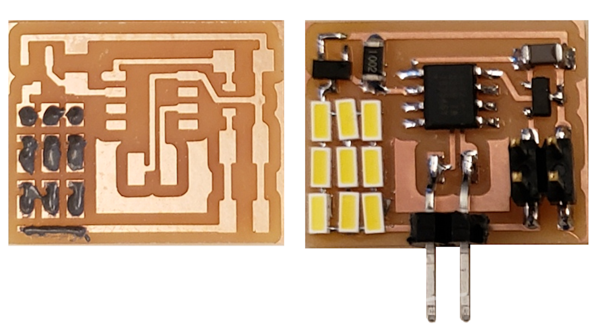
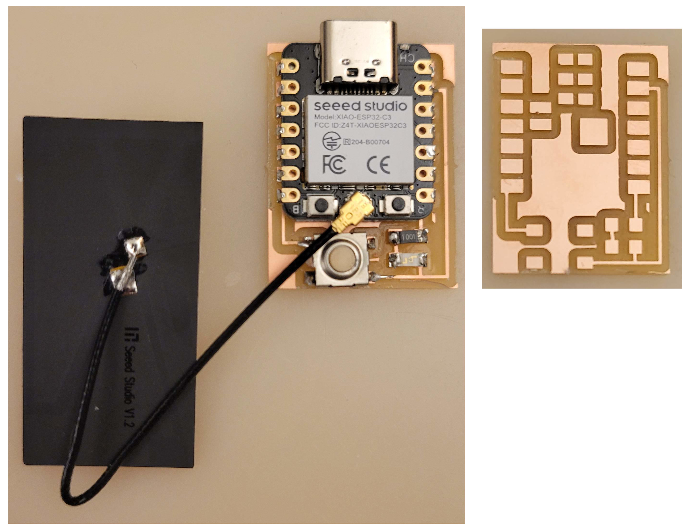

# LED

---

## LED array

### Hello array 44 (2012)

  
///caption  
Components  
///

[board](array/hello.array.44.png) [traces](array/hello.array.44.traces.png) [interior](array/hello.array.44.interior.png)  
[hello.array.44.c](array/hello.array.44.c) [makefile](array/hello.array.44.make) [video](array/hello.array.44.mp4)

---

### Hello array 44 2 (2012)

  
///caption  
Components  
///

[board](array/hello.array.44.2.png) [bottom](array/hello.array.44.2.bottom.png) [vias](array/hello.array.44.2.vias.png) [top](array/hello.array.44.2.top.png) [interior](array/hello.array.44.2.interior.png)  
[hello.array.44.2.c](array/hello.array.44.2.c) [makefile](array/hello.array.44.2.make) [video](array/hello.array.44.2.mp4)

---

### [Charlieplexing](http://www.maxim-ic.com/app-notes/index.mvp/id/1880)

---

## LEDs

### Hello LEDs t412 (2020)

  
///caption  
Components  
///

[board](LEDs/hello.LEDs.t412.png) [traces](LEDs/hello.LEDs.t412.traces.png) [interior](LEDs/hello.LEDs.t412.interior.png)  
[hello.LEDs.t412](LEDs/hello.LEDs.t412) [hello.LEDs.t412.ino](LEDs/hello.LEDs.t412.ino) [video](LEDs/hello.LEDs.t412.mp4)

---

### Hello button blink C3 (2023)

  
///caption  
Components  
///

[board](../embedded_programming/ESP32-C3/hello.button-blink.C3.png) [traces](../embedded_programming/ESP32-C3/hello.button-blink.C3.top.png) [interior](../embedded_programming/ESP32-C3/hello.button-blink.C3.interior.png)  
[hello.button-blink.C3](../embedded_programming/ESP32-C3/hello.button-blink.C3) [hello.button-blink.C3.ino](../embedded_programming/ESP32-C3/hello.button-blink.C3.ino) [hello.button-blink.C3.py](../embedded_programming/ESP32-C3/hello.button-blink.C3.py) [video](../embedded_programming/ESP32-C3/hello.button-blink.C3.mp4)

---

## PWM

### Hello fade C3 (2023)

[hello.fade.C3.py](fade/hello.fade.C3.py) 

[video](fade/hello.fade.C3.mp4)

---

## Talking points

diode drop, series-parallel

MOSFET
    [NDS355AN](http://www.digikey.com/product-detail/en/fairchild-semiconductor/NDS355AN/NDS355ANCT-ND), [NDS356AP](http://www.digikey.com/product-detail/en/fairchild-semiconductor/NDS356AP/NDS356APCT-ND), [RFD16N05LSM9A](http://www.digikey.com/product-detail/en/fairchild-semiconductor/RFD16N05LSM9A/RFD16N05LSM9ACT-ND)
    
floating gates

gate resistors

BJT, BiCMOS, IGBT

thermal runaway

eye safety

current limiting
