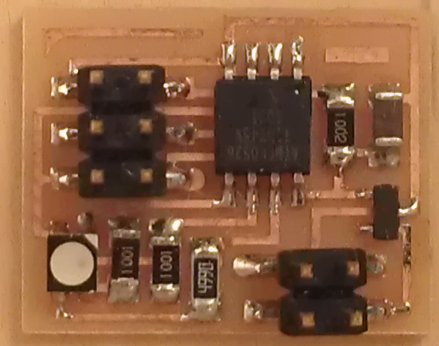
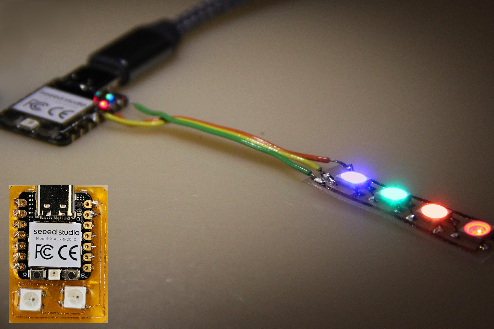

# RGB LED

---

## Examples

### Hello RGB 45 (2012 – )
  
///caption  
Components  
///
[C](RGB/hello.RGB.45.c) [board](RGB/hello.RGB.45.png) [interior](RGB/hello.RGB.45.interior.png) [makefile](RGB/hello.RGB.45.make) [traces](RGB/hello.RGB.45.traces.png) [video](RGB/hello.RGB.45.mp4)

---

### Hello WS2812B (2024 – )
  
///caption  
Components  
///
[board](Neo/hello.WS2812B.png) [interior](Neo/hello.WS2812B.interior.png) [makefile](Neo/hello.WS2812B.make) [traces](Neo/hello.WS2812B.traces.png) [video](Neo/hello.WS2812B.mp4)

---

## Talking points

PWM (2012 – 2024)  
pinouts (2018 – 2024)  
current limiting (2020 – 2024)  
3 in 1 (2024)  
[pixels](https://learn.adafruit.com/adafruit-dotstar-leds/overview) (2019)  
[lights](https://www.superbrightleds.com) (2019)  
[wires](https://www.amazon.com/s/keywords=electroluminescent) (2019)

---

*Judgement: “3 in 1” appeared as both a caption and a possible section note in 2024, so it is included as a talking point for clarity.*

