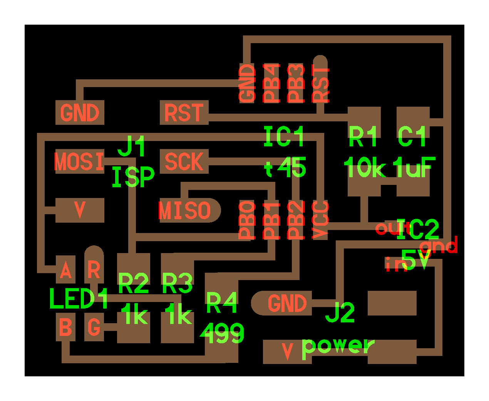
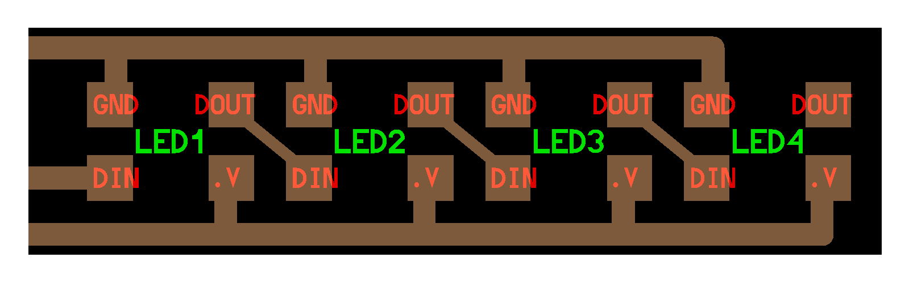

# RGB LEDs

---

## Examples

### hello.RGB.45 (2012 – 2025)
[hello.RGB.45.cad](RGB/hello.RGB.45.cad) [hello.RGB.45](RGB/hello.RGB.45)  
  
///caption  
Components  
///  
[board](RGB/hello.RGB.45.png) [components](RGB/hello.RGB.45.jpg) [traces](RGB/hello.RGB.45.traces.png) [traces+exterior](RGB/hello.RGB.45.traces_exterior.png) [interior](RGB/hello.RGB.45.interior.png) [C](RGB/hello.RGB.45.c) [makefile](RGB/hello.RGB.45.make) [video](RGB/hello.RGB.45.mp4)
---

### hello.RP2040-XIAO.blink-echo (2023)
[blink-echo.ino](RGB/hello.RP2040-XIAO.blink-echo.ino) [blink-echo.py](RGB/hello.RP2040-XIAO.blink-echo.py) [ws2812.py](RGB/ws2812.py) [video](RGB/hello.RP2040-XIAO.blink-echo.mp4)
---

### hello.WS2812B (2024 – 2025)
[hello.WS2812B](Neo/hello.WS2812B)  
  
///caption  
Components  
///  
[board](Neo/hello.WS2812B.png) [components](Neo/hello.WS2812B.RP2040.jpg) [top](Neo/hello.WS2812B.top.png) [interior](Neo/hello.WS2812B.interior.png) [hello.WS2812B.RP2040.py](Neo/hello.WS2812B.RP2040.py) [video](Neo/hello.WS2812B.RP2040.mp4)
---

## Talking points

[RGB LED](http://search.digikey.com/scripts/DkSearch/dksus.dll?Detail&name=CLV1A-FKB-CJ1M1F1BB7R4S3CT-ND) (2012 – 2014)  
[RGB LED](http://www.digikey.com/product-search/en?keywords=CLV1A-FKB-CK1N1G1BB7R4S3CT-ND) (2015 – 2017)  
[RGB LED](https://www.digikey.com/product-detail/en/cree-inc/CLV1A-FKB-CK1VW1DE1BB7C3C3/CLV1A-FKB-CK1VW1DE1BB7C3C3CT-ND) (2018 – 2023)  
[RGB LED](https://www.digikey.com/en/products/detail/adafruit-industries-llc/3094/6058485) (2024 – 2025)  
PWM (2012 – 2023)  
current limiting (2020 – 2025)  
[Charlieplexing](array/Charlieplexing.pdf) (2022)  
[3 in 1](https://www.digikey.com/product-detail/en/cree-inc/CLV1A-FKB-CK1VW1DE1BB7C3C3/CLV1A-FKB-CK1VW1DE1BB7C3C3CT-ND) (2024 – 2025)  
[pixels](https://learn.adafruit.com/adafruit-dotstar-leds/overview) (2018 – 2025)  
[lights](https://www.superbrightleds.com) (2018 – 2025)  
[wires](https://www.amazon.com/s/keywords=electroluminescent) (2018 – 2025)  
[NeoPixel/WS2812B/SK6812](https://www.digikey.com/en/products/detail/adafruit-industries-llc/3094/6058485) (2024 – 2025)  
[Arduino](https://github.com/adafruit/Adafruit_NeoPixel) (2024 – 2025)  
[Micropython](https://docs.micropython.org/en/latest/library/neopixel.html) (2024 – 2025)  
library (2024 – 2025)  
pinouts (2018 – 2021)  

---