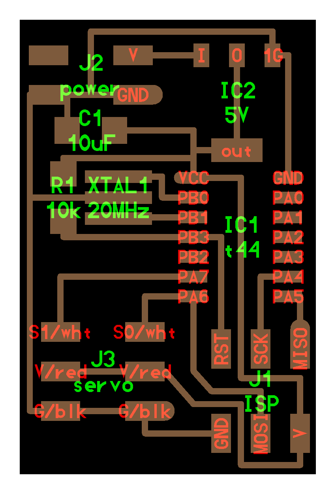
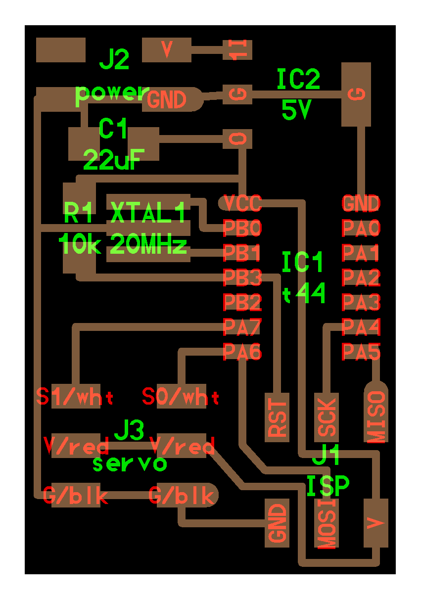
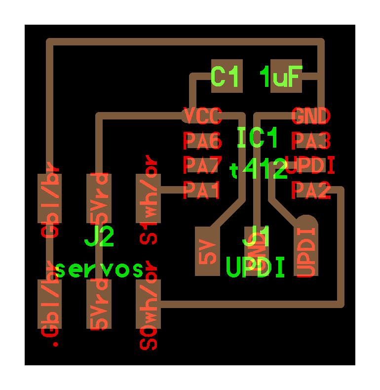
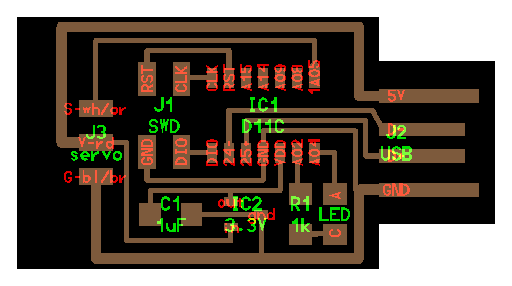

# Servo Motor

---

## Examples

### hello.servo.44 (2012 – 2025)

///caption
Components (ATtiny44)
///
[hello.servo.44.cad](servo/hello.servo.44.cad) [board](servo/hello.servo.44.png) [components](servo/hello.servo.44.jpg) [traces](servo/hello.servo.44.traces.png) [traces+exterior](servo/hello.servo.44.traces_exterior.png) [interior](servo/hello.servo.44.interior.png) [C (hardware PWM)](servo/hello.servo.44.c) [makefile](servo/hello.servo.44.make) [C (two-channel, software PWM)](servo/hello.servo.44.2.c) [makefile](servo/hello.servo.44.2.make) [video](servo/hello.servo.44.mp4)

---

### hello.servo.44.1 (2018 – 2025)

///caption
Components (ATtiny44, alt board)
///
[hello.servo.44.1](servo/hello.servo.44.1) [board](servo/hello.servo.44.1.png) [components](servo/hello.servo.44.1.jpg) [traces](servo/hello.servo.44.1.traces.png) [traces+exterior](servo/hello.servo.44.1.traces_exterior.png) [interior](servo/hello.servo.44.1.interior.png)

---

### hello.servo.t412 (2021 – 2025)

///caption
Components (ATtiny412)
///
[hello.servo.t412](servo/hello.servo.t412) [board](servo/hello.servo.t412.png) [components](servo/hello.servo.t412.jpg) [traces](servo/hello.servo.t412.traces.png) [traces+exterior](servo/hello.servo.t412.traces_exterior.png) [interior](servo/hello.servo.t412.interior.png) [hello.servo.t412.ino](servo/hello.servo.t412.ino) [hello.servo-registers.t412.ino](servo/hello.servo-registers.t412.ino) [video](servo/hello.servo.t412.mp4)

---

### hello.servo-D11C (2021 – 2025)

///caption
Components (ATSAMD11C)
///
[hello.servo-D11C](servo/hello.servo-D11C) [board](servo/hello.servo-D11C.png) [components](servo/hello.servo-D11C.jpg) [traces](servo/hello.servo-D11C.traces.png) [traces+exterior](servo/hello.servo-D11C.traces_exterior.png) [interior](servo/hello.servo-D11C.interior.png) [Gerber](servo/hello.servo-D11C.gbr.png) [top copper](servo/hello.servo-D11C.traces.png-fill.gbr) [solder mask](servo/hello.servo-D11C.mask.png-fill.gbr) [silkscreen](servo/hello.servo-D11C.silk.png-fill.gbr) [outline](servo/hello.servo-D11C.mech.png-outline.gbr) [hello.servo-registers.D11C.ino](servo/hello.servo-registers.D11C.ino) [video](servo/hello.servo-D11C.mp4)

---

## Talking points

[Servo motors at HobbyKing](http://www.hobbyking.com/hobbyking/store/__84__189__Servos_and_parts-All_Servos.html) (2012 – 2017)  
[Servo motors at HobbyKing, updated URL](https://hobbyking.com/en_us/radio-servos/servos.html?___store=en_us) (2018 – 2020)  
[Servo motors at Jameco](https://www.jameco.com/c/Electromechanical.html#/filter:ss_category:Electromechanical$253EMotors$253EServo/sort:price:asc) (2021 – 2022)  
[50 Hz ~1–2 ms PWM](servo/PWM.jpg) (2016 – 2025)  
(dis)continuous rotation (2018 – 2025)  
[ZLDO1117 LDO](https://www.diodes.com/assets/Datasheets/ZLDO1117.pdf) (2018 – 2025)  
[LM2940 LDO](http://www.ti.com/lit/ds/symlink/lm2940c.pdf) (2018 – 2025)  
[Brushless DC motor (BLDC)](https://hobbyking.com/en_us/electric-motors-1.html) (2016 – 2025)  
[Inrunner, outrunner, pancake, fan, gimbal (BLDC types)](https://hobbyking.com/en_us/electric-motors-1.html) (2016 – 2025)  
[Electronic speed controller (ESC)](https://www.amazon.com/s?k=esc+electronic+speed+controller) (2018 – 2025)  
[hello.ESC.44](ESC/hello.ESC.44) (2019 – 2025)  
[TGY Firmware](https://github.com/sim-/tgy) (2016 – 2025)  
servo PWM: initialization, calibration (2016 – 2025)  
LiPo batteries and charge controller (2018 – 2025)

---
