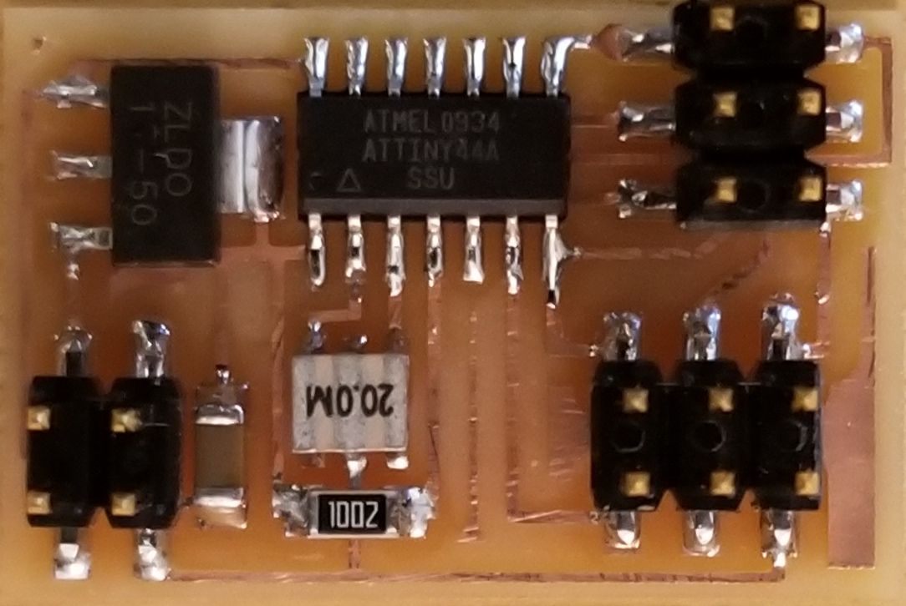
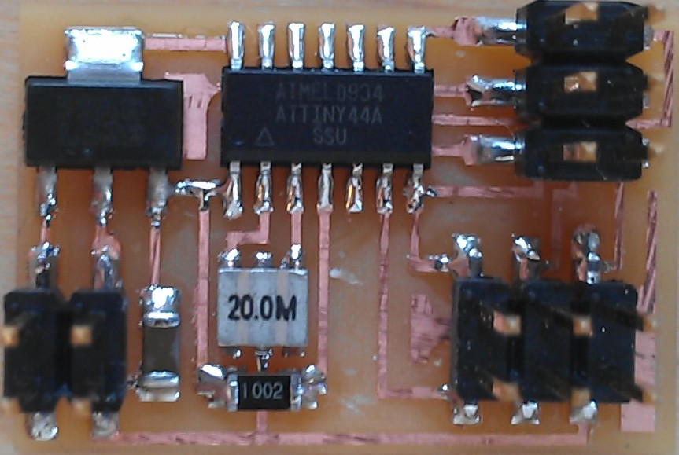
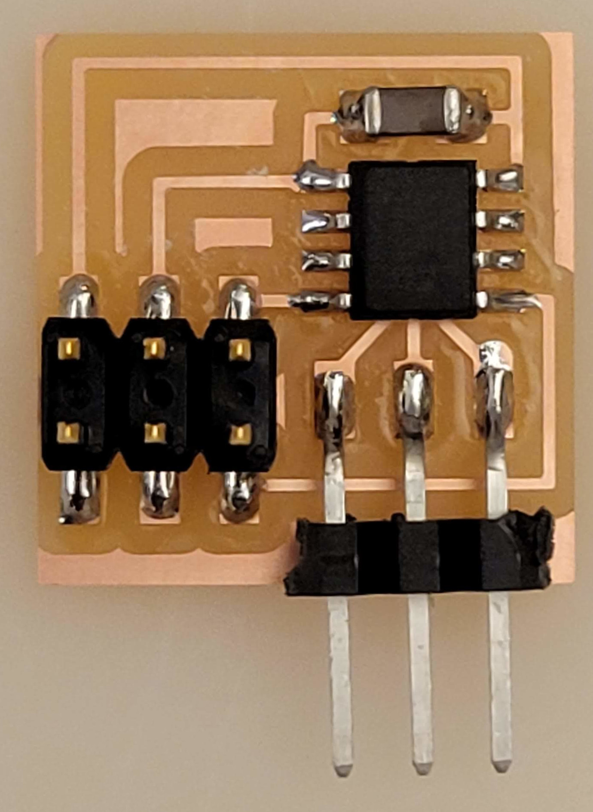
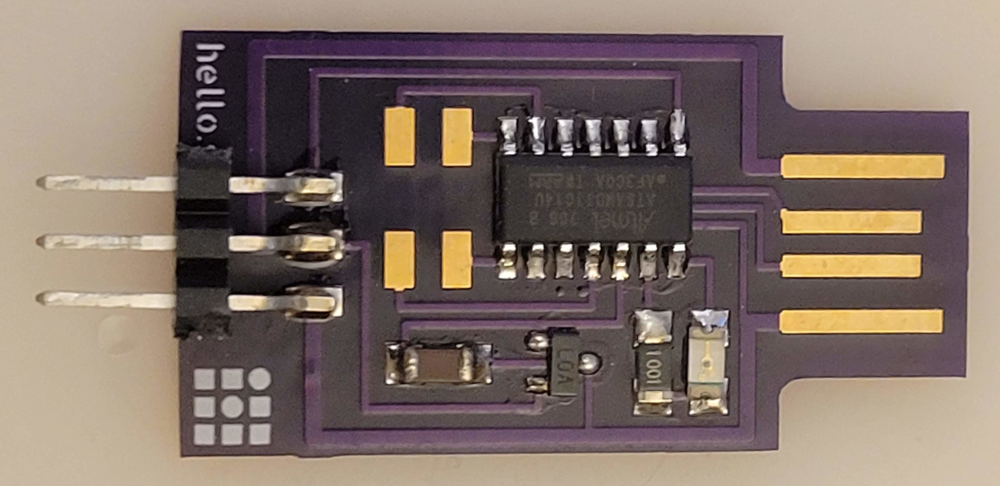

# [Servo](http://www.hobbyking.com/hobbyking/store/__84__189__Servos_and_parts-All_Servos.html)

---

## Examples

### hello.servo.44 (2012 – 2025)

  
///caption  
Single channel, hardware PWM  
///

[board](servo/hello.servo.44.png) [traces](servo/hello.servo.44.traces.png) [interior](servo/hello.servo.44.interior.png)  
[C (hardware PWM)](servo/hello.servo.44.c) [makefile](servo/hello.servo.44.make) [C (two-channel, software PWM)](servo/hello.servo.44.2.c) [makefile](servo/hello.servo.44.2.make) [video](servo/hello.servo.44.mp4)

---

### hello.servo.44.1 (2018 – 2025)

  
///caption  
(dis)continuous, Python  
///

[board](servo/hello.servo.44.1.png) [traces](servo/hello.servo.44.1.traces.png) [interior](servo/hello.servo.44.1.interior.png)  
[LM2940](http://www.ti.com/lit/ds/symlink/lm2940c.pdf)

---

### hello.servo.t412 (2021 – 2025)

  
///caption  
ATtiny412-based  
///

[board](servo/hello.servo.t412.png) [traces](servo/hello.servo.t412.traces.png) [interior](servo/hello.servo.t412.interior.png)  
[ino](servo/hello.servo.t412.ino) [registers](servo/hello.servo-registers.t412.ino) [video](servo/hello.servo.t412.mp4)

---

### hello.servo-D11C (2021 – 2025)

  
///caption  
ATSAMD11C-based  
///

[board](servo/hello.servo-D11C.png) [traces](servo/hello.servo-D11C.traces.png) [interior](servo/hello.servo-D11C.interior.png)  
[registers](servo/hello.servo-registers.D11C.ino) [video](servo/hello.servo-D11C.mp4)

---

## Talking Points

- (dis)continuous rotation
- 50 Hz ~1–2 ms PWM
- ATtiny44, ATtiny412, ATSAMD11C variants
- LM2940, ZLDO1117 regulators
- Gerber, top copper, solder mask, silkscreen, outline files

---

## Assignment Evolution

- **2012–2020:** Add a servo to your board, control with single/two-channel PWM (hardware/software).
- **2021–2025:** Expanded microcontroller support (ATtiny412, ATSAMD11C), more detailed PCB resources, and continuous/discontinuous rotation projects.

---

