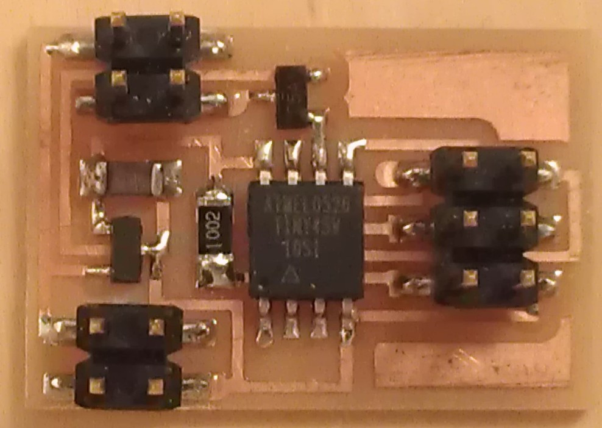
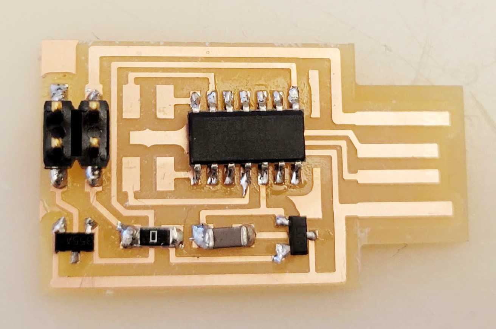

# SPEAKER

---

## Examples

### hello.speaker.45 (2012 – 2023)
  
///caption  
Components  
///
[C](speaker/hello.speaker.45.c) [board](speaker/hello.speaker.45.png) [interior](speaker/hello.speaker.45.interior.png) [makefile](speaker/hello.speaker.45.make) [traces](speaker/hello.speaker.45.traces.png) [traces+exterior](speaker/hello.speaker.45.traces_exterior.png) [video](speaker/hello.speaker.45.mp4) [wavetable](speaker/hello.speaker.45.wave.asm)

---

### hello.speaker.45.py (2018)
  
///caption  
Components  
///
[C](speaker/hello.speaker.45.c) [board](speaker/hello.speaker.45.png) [interior](speaker/hello.speaker.45.interior.png) [makefile](speaker/hello.speaker.45.make) [traces](speaker/hello.speaker.45.traces.png) [video](speaker/hello.speaker.45.mp4)

---

### hello.speaker.D11C (2022 – )
  
///caption  
Components  
///
[board](speaker/hello.speaker.D11C.png) [components](speaker/hello.speaker.D11C.jpg) [interior](speaker/hello.speaker.D11C.interior.png) [traces](speaker/hello.speaker.D11C.traces.png) [traces+exterior](speaker/hello.speaker.D11C.traces_exterior.png)

---

### hello.speaker.D11C.ino (2022 – )
[hello.speaker-registers.D11C.ino](speaker/hello.speaker-registers.D11C.ino) [video](speaker/hello.speaker.D11C.mp4)

---

### hello.TB67H451.RP2040.audio.ino (2023 – )
[boot.py](speaker/boot.py) [hello.TB67H451.RP2040.audio.py](speaker/hello.TB67H451.RP2040.audio.py) [video](speaker/hello.TB67H451.RP2040.audio.mp4)

---

### hello.TB67H451.RP2040.wave.ino (2023 – )
[convert.py](speaker/convert.py) [sample.ino](speaker/hello.TB67H451.RP2040.sample.ino) [sample.main.ino](speaker/hello.TB67H451.RP2040.sample.main.ino) [video](speaker/hello.TB67H451.RP2040.sample.mp4)

---

### hello.TB67H451.RP2040.wave.py (2023 – )
[convert_byterray.py](speaker/convert_byterray.py) [hello.py](speaker/hello.py) [sample.py](speaker/hello.TB67H451.RP2040.sample.py) [video](speaker/hello.TB67H451.RP2040.py.mp4)

---

### hello.MAX98357A.RP2040 (2024 – )
  
///caption  
Components  
///
[board](speaker/hello.MAX98357A.RP2040.png) [components](speaker/hello.MAX98357A.RP2040.jpg) [holes](speaker/hello.MAX98357A.RP2040.holes.png) [interior](speaker/hello.MAX98357A.RP2040.interior.png) [top](speaker/hello.MAX98357A.RP2040.top.png)

---

### hello.MAX98357A.RP2040.ino (2024 – )
[video](speaker/hello.MAX98357A.RP2040.mp4)

---

## Talking points

MOSFET (2012 – 2019)  
[MOSFET](http://search.digikey.com/scripts/DkSearch/dksus.dll?Detail&name=NDS355ANCT-ND) (2012 – 2015)  
[wavetable](speaker/hello.speaker.45.wave.asm) (2012 – 2023)  
class D amplifier (2014 – 2022)  
low-pass filter (2014 – 2022)  
parallel FETs (2014)  
gate resistors (2014 – 2019)  
floating gates (2015 – 2019)  
[NDS355AN](http://www.digikey.com/product-detail/en/fairchild-semiconductor/NDS355AN/NDS355ANCT-ND) (2016 – 2019)  
[NDS356AP](http://www.digikey.com/product-detail/en/fairchild-semiconductor/NDS356AP/NDS356APCT-ND) (2016 – 2019)  
[RFD16N05LSM9A](http://www.digikey.com/product-detail/en/fairchild-semiconductor/RFD16N05LSM9A/RFD16N05LSM9ACT-ND) (2016 – 2019)  
audio (2018 – 2023)  
[synthesis](https://moderndevice.com/product/fluxamasynth-shield) (2018 – 2021)  
class D amplifier (2022)  
[synthesizer](https://www.digikey.com/en/products/detail/adafruit-industries-llc/1681/9553564) (2022)  
PWM (2022)  
library (2023 – )  
[library](https://arduino-pico.readthedocs.io/en/latest/pwm.html) (2023 – )  
[library](https://learn.adafruit.com/mp3-playback-rp2040/pico-mp3) (2023 – )  
[module](https://www.dfrobot.com/product-1121.html) (2023 – )  
coming (2024)

---
