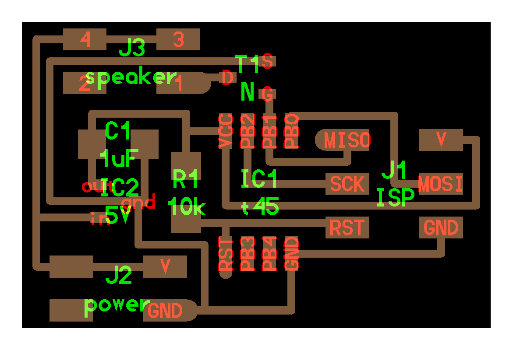
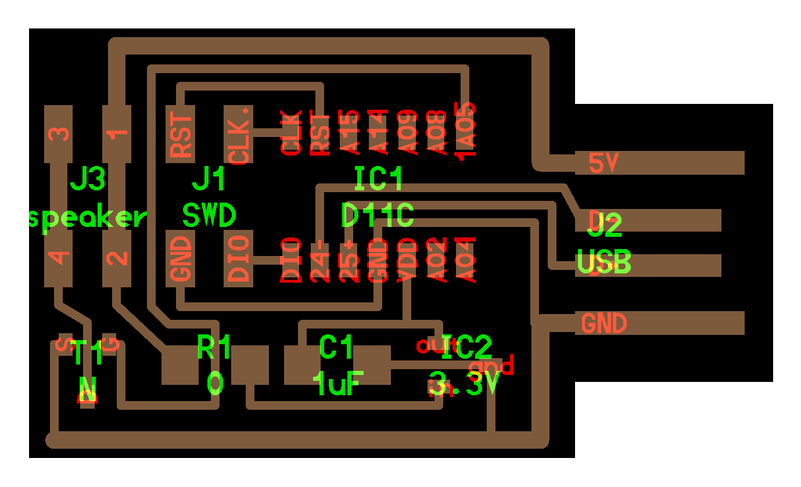
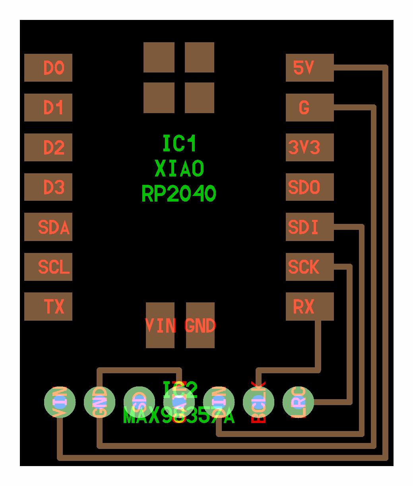

# Speaker

---

## Examples

### hello.speaker.45 (2012 – 2025)

///caption
Speaker board, MOSFET amplifier, wavetable playback
///
[hello.speaker.45.cad](speaker/hello.speaker.45.cad) [hello.speaker.45](speaker/hello.speaker.45) [board](speaker/hello.speaker.45.png) [components](speaker/hello.speaker.45.jpg) [traces](speaker/hello.speaker.45.traces.png) [traces+exterior](speaker/hello.speaker.45.traces_exterior.png) [interior](speaker/hello.speaker.45.interior.png) [C](speaker/hello.speaker.45.c) [makefile](speaker/hello.speaker.45.make) [video](speaker/hello.speaker.45.mp4) [wavetable](speaker/hello.speaker.45.wave.asm)

---

### hello.speaker.D11C (2022 – 2025)

///caption
ATSAMD11C-based speaker board, PWM/DAC audio
///
[hello.speaker.D11C](speaker/hello.speaker.D11C) [board](speaker/hello.speaker.D11C.png) [components](speaker/hello.speaker.D11C.jpg) [traces](speaker/hello.speaker.D11C.traces.png) [traces+exterior](speaker/hello.speaker.D11C.traces_exterior.png) [interior](speaker/hello.speaker.D11C.interior.png) [hello.speaker.D11C.ino](speaker/hello.speaker.D11C.ino) [hello.speaker-registers.D11C.ino](speaker/hello.speaker-registers.D11C.ino) [video](speaker/hello.speaker.D11C.mp4)

---

### hello.TB67H451.RP2040 (2023 – 2025)

[hello.TB67H451.RP2040.audio.ino](H-bridge/hello.TB67H451.RP2040.audio.ino) [hello.TB67H451.RP2040.audio.py](H-bridge/hello.TB67H451.RP2040.audio.py) [boot.py](H-bridge/boot.py) [video](H-bridge/hello.TB67H451.RP2040.audio.mp4) [hello.TB67H451.RP2040.wave.py](H-bridge/hello.TB67H451.RP2040.wave.py) [sample.py](H-bridge/hello.TB67H451.RP2040.sample.py) [hello.py](H-bridge/hello.py) [convert_byterray.py](H-bridge/convert_byterray.py) [video](H-bridge/hello.TB67H451.RP2040.py.mp4) [hello.TB67H451.RP2040.wave.ino](H-bridge/hello.TB67H451.RP2040.wave.ino) [sample.ino](H-bridge/hello.TB67H451.RP2040.sample.ino) [sample.main.ino](H-bridge/hello.TB67H451.RP2040.sample.main.ino) [convert.py](H-bridge/convert.py) [video](H-bridge/hello.TB67H451.RP2040.sample.mp4)

---

### hello.MAX98357A.RP2040 (2024 – 2025)

///caption
I2S digital audio, MAX98357A, RP2040
///
[hello.MAX98357A.RP2040](I2S/hello.MAX98357A.RP2040) [board](I2S/hello.MAX98357A.RP2040.png) [components](I2S/hello.MAX98357A.RP2040.jpg) [top](I2S/hello.MAX98357A.RP2040.top.png) [holes](I2S/hello.MAX98357A.RP2040.holes.png) [interior](I2S/hello.MAX98357A.RP2040.interior.png) [hello.MAX98357A.RP2040.ino](I2S/hello.MAX98357A.RP2040.ino) [video](I2S/hello.MAX98357A.RP2040.mp4)

---

## Talking points

[GC0351M-ND speaker (Digi-Key)](http://search.digikey.com/scripts/DkSearch/dksus.dll?WT.z_header=search_go&lang=en&site=us&keywords=GC0351M-ND&x=0&y=0) (2012 – 2013)  
[PSR-23F08S-JQ speaker (Digi-Key)](http://www.digikey.com/product-detail/en/PSR-23F08S-JQ/458-1124-ND) (2014 – 2017)  
[PSR-57N08A01-AQ speaker (Digi-Key)](https://www.digikey.com/product-detail/en/mallory-sonalert-products-inc/PSR-57N08A01-AQ/458-1136-ND) (2018 – 2025)  
[MOSFETs (NDS355AN, NDS356AP, RFD16N05LSM9A)](http://www.digikey.com/product-detail/en/fairchild-semiconductor/NDS355AN/NDS355ANCT-ND) (2012 – 2021)  
[Floating gates, gate resistors, low-pass filters, class D amplifiers](#) (2014 – 2022)  
[Audio wavetable, Brian Mayton](http://fab.cba.mit.edu/classes/863.10/people/brian.mayton/10.html) (2018 – 2025)  
[FM recording example, Brian Mayton](http://fab.cba.mit.edu/classes/863.10/people/brian.mayton/06/avr_fm_recording.mp3) (2018 – 2025)  
[Fluxamasynth MIDI shield](https://moderndevice.com/product/fluxamasynth-shield) (2018 – 2021)  
[Adafruit MAX98357A I2S amplifier](https://www.digikey.com/en/products/detail/analog-devices-inc-maxim-integrated/MAX98357AETE-T/4936122) (2024 – 2025)  
[I2S on RP2040](https://arduino-pico.readthedocs.io/en/latest/i2s.html) (2024 – 2025)  
[MP3 library (Adafruit, Pico)](https://learn.adafruit.com/mp3-playback-rp2040/pico-mp3) (2023 – 2025)  
[DFRobot MP3 module](https://www.dfrobot.com/product-1121.html) (2023 – 2025)  
[Synthesizer, Adafruit 1681](https://www.digikey.com/en/products/detail/adafruit-industries-llc/1681/9553564) (2022)  
[H-bridge/driver ICs: A4953, A4950, DRV8838, TB67H451FNG, DRV8847](https://www.digikey.com/product-detail/en/allegro-microsystems-llc/A4953ELJTR-T/620-1428-1-ND) (2012 – 2025)  
[Solenoid actuator (Nerdkits xylophone)](http://www.nerdkits.com/videos/robotic_xylophone) (2017 – 2025)  
[vibration motors](https://www.amazon.com/s?k=vibration+motor) (2015 – 2022)  
[Heat sinks](https://www.digikey.com/en/products/filter/thermal-heat-sinks/219) (2022)  

---
