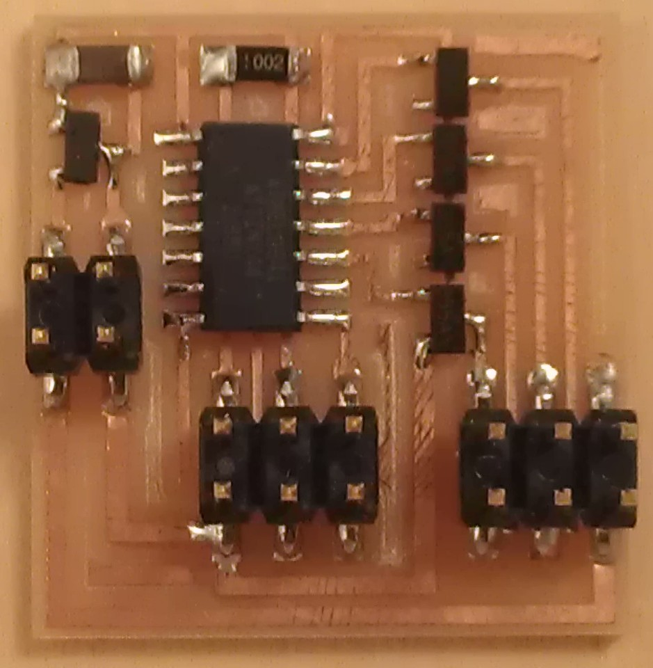
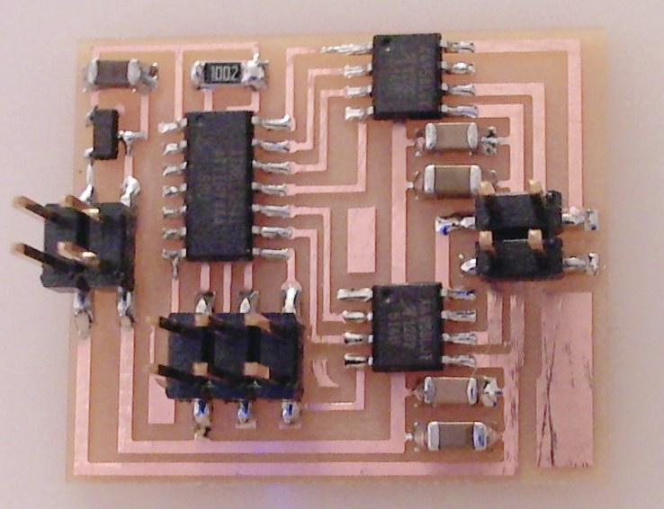
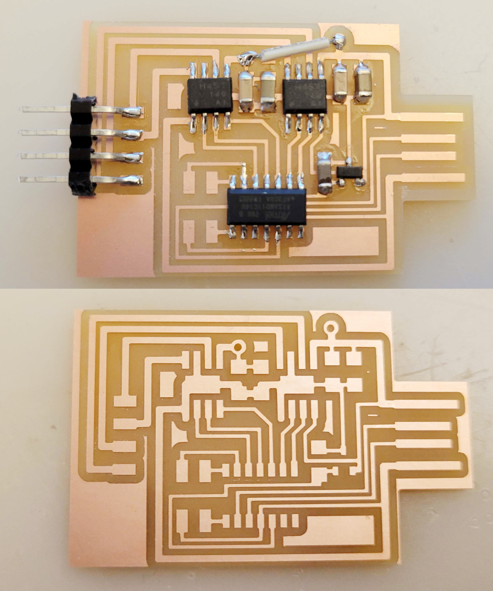
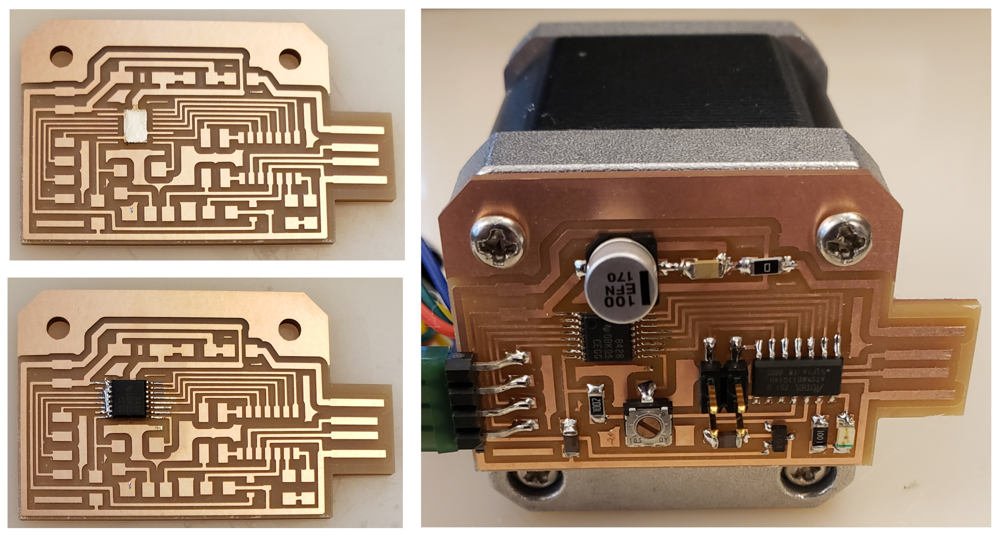
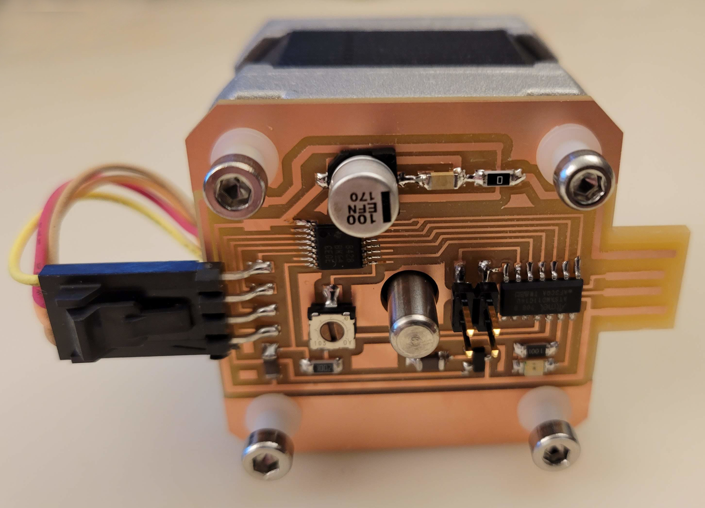
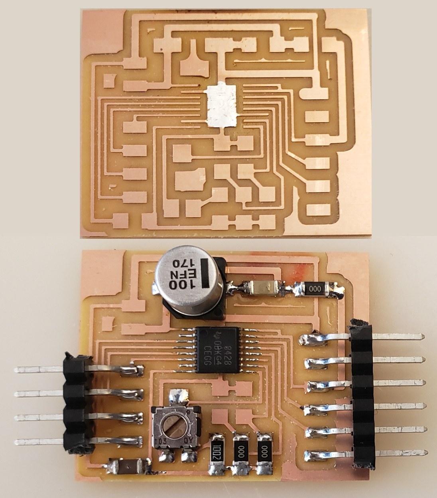

# Stepper Motor

---

## Examples

### hello.stepper.44 (2012 – 2024)

///caption  
Components  
///
[hello.stepper.44.cad](stepper/hello.stepper.44.cad) [board](stepper/hello.stepper.44.png) [components](stepper/hello.stepper.44.jpg) [traces](stepper/hello.stepper.44.traces.png) [interior](stepper/hello.stepper.44.interior.png) [wave](stepper/hello.stepper.44.wave.c) [makefile (wave)](stepper/hello.stepper.44.wave.make) [full](stepper/hello.stepper.44.full.c) [makefile (full)](stepper/hello.stepper.44.full.make) [half](stepper/hello.stepper.44.half.c) [makefile (half)](stepper/hello.stepper.44.half.make) [video](stepper/hello.stepper.44.mp4)

---

### hello.stepper.bipolar.44 (2012 – 2025)

///caption  
Components  
///
[hello.stepper.bipolar.44.cad](stepper/hello.stepper.bipolar.44.cad) [board](stepper/hello.stepper.bipolar.44.png) [components](stepper/hello.stepper.bipolar.44.jpg) [traces](stepper/hello.stepper.bipolar.44.traces.png) [traces+exterior](stepper/hello.stepper.bipolar.44.traces_exterior.png) [interior](stepper/hello.stepper.bipolar.44.interior.png) [full](stepper/hello.stepper.bipolar.44.full.c) [makefile (full)](stepper/hello.stepper.bipolar.44.full.make) [video](stepper/hello.stepper.bipolar.44.mp4)

---

### hello.stepper.bipolar.D11C (2022 – 2025)

///caption  
Components  
///
[hello.stepper.bipolar.D11C](stepper/hello.stepper.bipolar.D11C) [board](stepper/hello.stepper.bipolar.D11C.png) [components](stepper/hello.stepper.bipolar.D11C.jpg) [top](stepper/hello.stepper.bipolar.D11C.top.png) [top+exterior](stepper/hello.stepper.bipolar.D11C.top_exterior.png) [bottom](stepper/hello.stepper.bipolar.D11C.bottom.png) [holes](stepper/hello.stepper.bipolar.D11C.holes.png) [interior](stepper/hello.stepper.bipolar.D11C.interior.png) [hello.stepper.bipolar.D11C.ino](stepper/hello.stepper.bipolar.D11C.ino) [video](stepper/hello.stepper.bipolar.D11C.mp4)

---

### hello.DRV8428-D11C (2021 – 2025)

///caption  
Components  
///
[hello.DRV8428-D11C](DRV8428/hello.DRV8428-D11C) [board](DRV8428/hello.DRV8428-D11C.png) [components](DRV8428/hello.DRV8428-D11C.jpg) [traces](DRV8428/hello.DRV8428-D11C.traces.png) [traces+exterior](DRV8428/hello.DRV8428-D11C.traces_exterior.png) [holes](DRV8428/hello.DRV8428-D11C.holes.png) [interior](DRV8428/hello.DRV8428-D11C.interior.png) [hello.DRV8428-D11C.ino](DRV8428/hello.DRV8428-D11C.ino) [video](DRV8428/hello.DRV8428-D11C.mp4)

---

### hello.DRV8428-D11C-NEMA17 (2021 – 2025)

///caption  
Components  
///
[hello.DRV8428-D11C-NEMA17](DRV8428/hello.DRV8428-D11C-NEMA17) [board](DRV8428/hello.DRV8428-D11C-NEMA17.png) [components](DRV8428/hello.DRV8428-D11C-NEMA17.jpg) [traces](DRV8428/hello.DRV8428-D11C-NEMA17.traces.png) [traces+exterior](DRV8428/hello.DRV8428-D11C-NEMA17.traces_exterior.png) [holes](DRV8428/hello.DRV8428-D11C-NEMA17.holes.png) [interior](DRV8428/hello.DRV8428-D11C-NEMA17.interior.png) [Gerber](DRV8428/hello.DRV8428-D11C-NEMA17.gbr.png) [top copper](DRV8428/hello.DRV8428-D11C-NEMA17.traces.png-fill.gbr) [solder mask](DRV8428/hello.DRV8428-D11C-NEMA17.mask.png-fill.gbr) [silkscreen](DRV8428/hello.DRV8428-D11C-NEMA17.silk.png-fill.gbr) [outline](DRV8428/hello.DRV8428-D11C-NEMA17.mech.png-outline.gbr)

---

### hello.DRV8428 (2021)

///caption  
Components  
///
[hello.DRV8428](DRV8428/hello.DRV8428) [board](DRV8428/hello.DRV8428.png) [components](DRV8428/hello.DRV8428.jpg) [traces](DRV8428/hello.DRV8428.top.png) [interior](DRV8428/hello.DRV8428.interior.png) [hello.DRV8428.ino](DRV8428/hello.DRV8428.ino) [video](DRV8428/hello.DRV8428.mp4)

---

## Talking points

[stepper motor at Jameco](http://www.jameco.com/webapp/wcs/stores/servlet/Product_10001_10001_2138812_-1) (2012 – 2014)  
[stepper motor at Jameco](http://www.jameco.com/webapp/wcs/stores/servlet/StoreCatalogDrillDownView?langId=-1&storeId=10001&catalogId=10001&categoryName=cat_3515&subCategoryName=Electromechanical%20%2F%20Motors%20%2F%20Stepper&category=351580) (2015 – 2016)  
[stepper motor types](https://www.motioncontrolproducts.com/applications/stepper-motor-how-does-it-work/) (2021 – 2025)  
[DRV8428](https://www.digikey.com/en/products/detail/texas-instruments/DRV8428PWPR/13563046) (2021 – 2025)  
[DRV8436 breakout board](https://gitlab.cba.mit.edu/zfredin/drv8436_breakout) (2021 – 2025)  
[DRV8436](https://www.digikey.com/en/products/detail/texas-instruments/DRV8436RGER/13532322) (2021)  
[code video](https://gitlab.cba.mit.edu/neilg/urumbu/-/tree/master/serialstep) (2022 – 2025)  
[DVR8428P](https://gitlab.cba.mit.edu/neilg/urumbu/-/tree/master/serialstep/serialstep-DRV8428P) (2022 – 2023)  
[stepper driver (QM Series)](https://www.xfoyomotor.com/stepper-driver/2-phase-stepper-driver/2-phase-stepper-driver-qm-series.html) (2024 – 2025)  
[motion control](../machine_design/index.html) (2021 – 2024)  
[motion control](https://academy.cba.mit.edu/classes/machine_design/index.html) (2025)  
[electro-permanent paper](http://cba.mit.edu/docs/papers/12.10.IROS.pdf) (2013 – 2025)  
[electrostatic actuator](https://ieeexplore.ieee.org/document/9194000) (2024 – 2025)  
[shape memory](http://fab.cba.mit.edu/classes/863.10/people/jie.qi/jieweek10.html) (2017 – 2024)  
[piezo actuator](http://www.pi-usa.us/products/PiezoActuators/index.php) (2017 – 2024)  
[polymer actuator](https://link.springer.com/article/10.1007/s42558-019-0005-1) (2020 – 2021)  
[artificial muscle](https://science.sciencemag.org/content/343/6173/868) (2020 – 2021)  
[fishing line artificial muscle](https://www.instructables.com/Fabricating-Fishing-Line-Artificial-Muscle-at-Home) (2020 – 2021)  
[conducting thread](https://www.jameco.com/z/200121235364HCB-Jameco-Valuepro-Conductive-Sewing-Thread-Size-92-235x36-4-Ply-Hobby-Cone_2144489.html) (2020 – 2021)  
[soft robotics](https://gmwgroup.harvard.edu/soft-robotics) (2019 – 2021)  
[inflatable](https://www.youtube.com/watch?v=SjJkt0zypkw) (2017 – 2021)  
[pneumatics](https://www.softrobotics.io) (2021)  
[hydraulics](http://www.moog.com/content/sites/global/en/products/actuators-servoactuators/actuation-technologies/electrohydraulic.html) (2017 – 2021)

---
