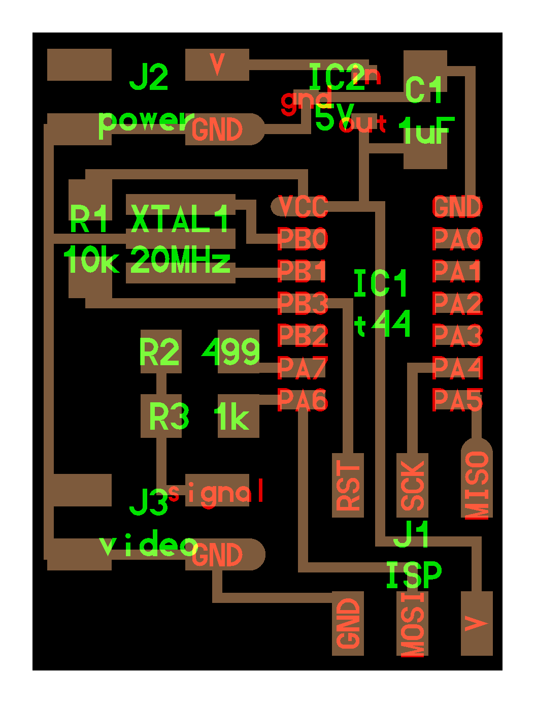

# Video

---

## Examples

### hello.video.44 (2012 – 2025)

///caption
Composite video output  
///
[hello.video.44](video/hello.video.44) [hello.video.44.cad](video/hello.video.44.cad) [board](video/hello.video.44.png) [components](video/hello.video.44.jpg) [traces](video/hello.video.44.traces.png) [traces+exterior](video/hello.video.44.traces_exterior.png) [interior](video/hello.video.44.interior.png) [C](video/hello.video.44.c) [makefile](video/hello.video.44.make) [asm](video/hello.video.44.asm) [video](video/hello.video.44.mp4)
---

## Talking points

[RS170](RS-170.jpg) (2012 – 2025)  
NTSC, PAL, SECAM, VGA (2012 – 2025)  
75 ohm impedance (2012 – 2025)  
[SPI](http://fabacademy.org/archives/2014/students/fletcher.james/week12.html) (2014 – 2025)  
[TVout](https://code.google.com/p/arduino-tvout/) (2014 – 2025)  
[Thinner client](https://github.com/davidcranor/Thinner-Client) (2012 – 2018)  
[Thinner client](https://github.com/davidcranor/Thinner-Client/blob/master/Pictures/photo%201.JPG) (2018 – 2025)  
[Color video](https://www.google.com/search?q=xmega+color+video) (2015 – 2025)  
