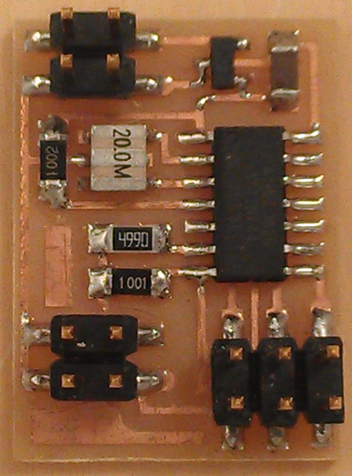

# VIDEO

---

## Examples

### hello.video.44 (2012 – )
  
///caption  
Components  
///
[board](video/hello.video.44.png) [traces](video/hello.video.44.traces.png) [interior](video/hello.video.44.interior.png) [C](video/hello.video.44.c) [makefile](video/hello.video.44.make) [video](video/hello.video.44.mp4) [asm](video/hello.video.44.asm)

---

## Talking points

75 ohm impedance (2012 – )
[RS170](RS-170.jpg) (2012 – 2024)
[RS170](https://academy.cba.mit.edu/classes/output_devices/RS-170.jpg) (2025)
[SPI](http://fabacademy.org/archives/2014/students/fletcher.james/week12.html) (2014 – )
[TVout](https://code.google.com/p/arduino-tvout/) (2014 – )
[color](https://www.google.com/search?q=xmega+color+video) (2017 – )
[color](https://www.google.com/webhp?ion=1&espv=2&ie=UTF-8#q=xmega+color+video&tbm=vid) (2015 – 2016)
[thinner client](https://github.com/davidcranor/Thinner-Client) (2013 – 2017)
[thinner client](https://github.com/davidcranor/Thinner-Client/blob/master/Pictures/photo%201.JPG) (2018 – )
NTSC (2012 – )
PAL (2012 – )
SECAM (2012 – )
VGA (2012 – )

---
